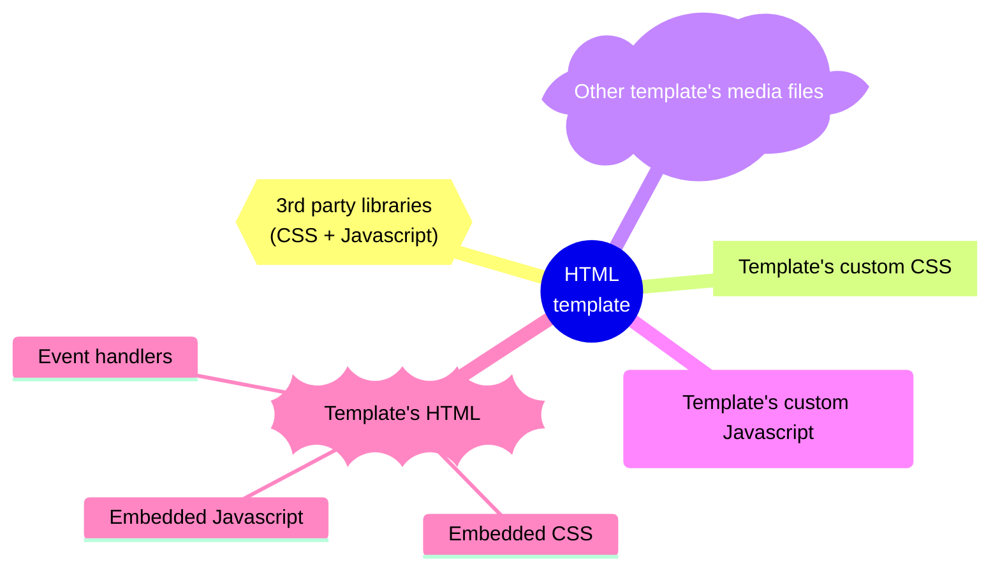
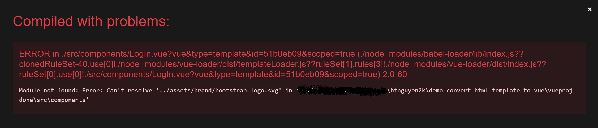

When initiating a new Vue project you may come across an HTML template appears to be a good fit for your needs. However, using this template directly in your Vue project won't work because it is not in the form of a Vue component. Therefore, you need to convert the HTML template into a Vue component before it can be utilized. This post offers a detailed guide with step-by-step instructions on how to carry out the conversion process, enabling you to use the HTML template as a Vue component in your project.

This post assumes that you have experience with Vue and are proficient in working with HTML/CSS/JavaScript as well as related tools such as `npm`. We will transform a [Bootstrap-designed login page](https://getbootstrap.com/docs/5.3/examples/sign-in/) into a Vue component. This login page has a user interface designed using Bootstrap 5, consisting of _1 HTML page_, _1 CSS file_, and _1 JavaScript file_. Once you comprehend the process for converting an HTML page to a Vue component, transforming a multi-page HTML template should not be difficult.

```bs-alert info

The complete source code for both the original HTML template and the converted Vue component is available for download at this [GitHub repository](https://github.com/btnguyen2k/demo-convert-html-template-to-vue).
```

## 0. Create a new Vue project

Let's start with a simple Vue project structure by creating a new, fresh Vue 3 project with the command `vue create` as outlined in the [official documentation](https://cli.vuejs.org/guide/creating-a-project.html). This generates a basic project structure that includes a single component named `HelloWorld` stored in the `src/components/HelloWorld.vue` file.

As we are converting an HTML login page to a Vue component, it makes sense to create a new component called `LogIn` that will be stored in the `src/components/LogIn.vue` file. Since this component is freshly created, the contents of the `LogIn.vue` file will be similar to the following:

```html
<template>
    <div>//TODO</div>
</template>

<style scoped>
</style>


<script>
export default {
    name: 'LogIn',
}
</script>
```

Additionally, we are required to make changes to the `src/App.vue` file as outlined below:
```bs-tabs
    [[bs-tab new App.vue
    ```html
    <template>
        <LogIn />
    </template>

    <script>
    import LogIn from './components/LogIn.vue'

    export default {
        name: 'App',
        components: {
            LogIn
        }
    }
    </script>

    <style>
    #app {
    ...
    ```
    ]]

    [[bs-tab original App.vue
    ```html
    <template>
        
        <HelloWorld msg="Welcome to Your Vue.js App"/>
    </template>

    <script>
    import HelloWorld from './components/HelloWorld.vue'

    export default {
        name: 'App',
        components: {
            HelloWorld
        }
    }
    </script>

    <style>
    #app {
    ...
    ```
    ]]
```

The project's directory structure will be similar to the following:
```
vueproj/
├── README.md
├── babel.config.js
├── jsconfig.json
├── package-lock.json
├── package.json
├── public
│   ├── favicon.ico
│   └── index.html
├── src
│   ├── App.vue                   <-- update this file to incorporate the newly created LogIn component
│   ├── assets
│   │   └── logo.png
│   ├── components
│   |   ├── LogIn.vue             <-- our newly created LogIn component
│   │   └── HelloWorld.vue        <-- this file can be removed
│   └── main.js
└── vue.config.js
```

```bs-alert primary

Please note that it is important to name the component `LogIn` (with a capital letter `I`). Otherwise, Vue may issue a warning with the message: `Component name "Login" should always be multi-word  vue/multi-word-component-names`.
```

## 1. Plan the transformation

To summarize, the following crucial elements must be converted to Vue-compatible elements:



## 2. Third-party libraries

Incorporating third-party libraries into Vue can be challenging, but it can also be straightforward. However, this is a critical step in determining whether you can use an HTML template in your Vue project. If the third-party library has a compatible plugin for the version of Vue you are using, then congratulations! If not, it may be more practical to seek out another template. Fortunately, Vue is a popular framework and most third-party libraries have Vue-compatible plugins available. In this post, we are using a login HTML template that utilizes _Bootstrap 5_ as the third-party library. To get started, we will install _Bootstrap_ and _Bootstrap icons_ using the following commands:

```sh
$ npm install bootstrap -S

# You can also install a specific version
$ npm install bootstrap@5.3.0-alpha3 -S
```

and
```sh
$ npm i bootstrap-icons -S
```

The next step is to import Bootstrap and Bootstrap icons in the `<style>` section of the `src/App.vue` file:
```html
<style lang="css">
/* Bootstrap 5.x */
@import "bootstrap/dist/css/bootstrap.min.css";
@import "bootstrap";
@import "bootstrap-icons";

...
</style>
```

Finally, while the template we used in this post does not include other Bootstrap components, it is advisable to import all necessary Bootstrap components in a single place and reuse them across all Vue components in a real-world project. To do this, we will import the necessary components in the `src/main.js` file using the following code:
```js
const app = createApp(App)

...

// Start: enable Bootstrap components
import {Alert,Button,Carousel,Collapse,Dropdown,Modal,Offcanvas,Popover,ScrollSpy,Tab,Toast,Tooltip} from 'bootstrap'
app.component(Alert)
app.component(Button)
app.component(Carousel)
app.component(Collapse)
app.component(Dropdown)
app.component(Modal)
app.component(Offcanvas)
app.component(Popover)
app.component(ScrollSpy)
app.component(Tab)
app.component(Toast)
app.component(Tooltip)
// End

...

app.mount('#app')
```

```bs-alert primary

In certain Vue projects, you may come across the shorthand `createApp(App).mount('#app')`. However, it is highly recommended to separate the initialization part of `App` from the mounting part of `#app` by declaring `const app = createApp(app)` and then mounting `app.mount('#app')`. By doing this, it becomes more convenient to add additional configurations or perform initialization, such as importing other plugins before mounting `#app`.
```

## 3. Template's HTML

Converting the template's HTML to a Vue component is relatively straightforward - just copy the HTML code and place it within the `<template>` section. However, there are some important points to keep in mind:

**Only the HTML code between `<body>` and `</body>` should be copied.**

You may encounter an error or warning message stating `The template root requires exactly one element`. This is because older versions of Vue only accept exactly one element at the template root level. This means that if there are more than two HTML tags, such as:
```html
<template>
    <header>
        <h1>Welcome</h1>
    </header>
    <section>
        <p>Here is some content.</p>
    </section>
</template>
```

then will receive such an error or warning message. To solve this issue, you can either upgrade to a newer version of Vue, IDE, and corresponding plugins and libraries, or simply wrap everything inside a `<div>` tag as in the following code:
```html
<template>
    <div>
        <header>
            <h1>Welcome</h1>
        </header>
        <section>
            <p>Here is some content.</p>
        </section>
    </div>
</template>
```

_This post adopted the second method, which is to enclose all HTML elements inside a `<div>` tag._

To ensure that the styling of the HTML template is retained in the Vue component, we need to **copy all the CSS code embedded** in the `<style>` and `</style>` tags and paste them into the Vue component's `<style>` section. Keep in mind that there could be multiple `<style>` sections in the HTML template file. The contents of our `LogIn.vue` would be similar to the following:
```html
<template>
    <div>
        ...
    </div>
</template>

<style scoped>
.bd-placeholder-img {
    font-size: 1.125rem;
    text-anchor: middle;
    -webkit-user-select: none;
    -moz-user-select: none;
    user-select: none;
}
...
</style>

<script>
export default {
    name: 'LogIn',
}
</script>
```

**Retain inline CSS code** (for instance, `<p style="font-size: small">`). Omit _third-party CSS_ files (such as Bootstrap) since they have already been imported in step (2) above. Likewise, exclude all _Javascript_ content, including inline code, `<script>` tags, and external `.js` files. We will address Javascript at a later stage.

At this stage, you might still encounter an error while launching the Vue project, as shown in the following image. However, there is no need to worry because we will resolve this issue in the upcoming steps to create a functional web page.


 
 ## 4. CSS, Javascript and other media files

In the HTML template you're working with, you may find external CSS, Javascript, and media files such as images. The login HTML page used in this post, for example, has an external `sign-in.css`, `color-modes.js`, and `bootstrap-logo.svg` files. We will keep them **organized in the directory `src/assets`**. The directory structure will look like this:
 ```
vueproj/
├── src
│   ├── assets
│   │   ├── css
│   │   │   └── sign-in.css               <-- CSS files are placed in the 'css' directory
│   │   ├── images
│   │   │   └── bootstrap-logo.svg        <-- images files are placed in the 'images' directory
...
```

```bs-alert primary

Please note that we did not include the `color-modes.js` file in the `src/assets` directory, as we will handle Javascript at a later stage.
```

```bs-alert info

For real-world projects, it's common to come across other types of media files, such as fonts. You can also organize them under `the src/assets` directory. Additionally, you may choose to extract embedded CSS code from `<style>` sections and store it in external files instead of having it inside the `.vue` files.
```

Prior to proceeding to the next part, it is important to verify the contents of the files located in the `src/assets` directory to ensure that file references are accurate. For example, a CSS file may include a reference similar to `background-image: url('background.jpg')`. Therefore, it is essential to ensure that the reference path for the file `background.jpg` is correct.

## 5. Final update to LogIn.vue file

Our Vue component is not functioning as expected yet. We need to address the remaining issues, which includes incorporating Javascript code. Open the `LogIn.vue` file and update the media file references. The HTML template we used in this post has only one reference that needs to be updated. Locate the line that contains `` and change it to ``. We also need to import CSS files. To do so, add the following line `@import "@/assets/css/sign-in.css";` to the `<style>` section of the `LogIn.vue` file, like this:

```html
<style scoped>
@import "@/assets/css/sign-in.css";

.bd-placeholder-img {
    font-size: 1.125rem;
    text-anchor: middle;
    -webkit-user-select: none;
    -moz-user-select: none;
    user-select: none;
}
...
</style>
```

Our result so far:
```bs-cards lightbox=result
    [[bs-card border=primary
    -img:result-1.jpg
    ]]
```

Next, we need to center the login form on the screen, similar to the original HTML template. To achieve this, we add `class="vw-100"` to the top-level `div` tag, as shown below:
```bs-tabs
    [[bs-tab new LogIn.vue
    ```html
    <template>
        <div class="vw-100">
            <svg xmlns="http://www.w3.org/2000/svg" style="display: none;">
    ...
    ```
    ]]

    [[bs-tab original LogIn.vue
    ```html
    <template>
        <div>
            <svg xmlns="http://www.w3.org/2000/svg" style="display: none;">
    ...
    ```
    ]]
```

We are nearly there:
```bs-cards lightbox=result
    [[bs-card border=primary
    -img:result-2.jpg
    ]]
```

The final step is to integrate the JavaScript code to make the color-selection menu located at the bottom right functional. We still have the `color-modes.js` file to take care of. It's time to work on it since the JavaScript code to handle the menu is in this file. Copy the JavaScript code from `color-modes.js` and paste it in the `mounted` section of the `LogIn.vue` file:

```html
<script>
export default {
    name: 'LogIn',
    mounted() {
        /* the Javascript code from `color-modes.js` file goes here */
    }
}
```

And here is our final result:
```bs-cards lightbox=result
    [[bs-card border=primary
    -img:result-3.jpg
    ]]
```

The entire source code for both the initial HTML template and the transformed Vue component are available at this [GitHub repository](https://github.com/btnguyen2k/demo-convert-html-template-to-vue).

```bs-alert info

The HTML template we worked on in this article does not have any inline events like `onClick=....` In real-world projects, if you encounter inline events, you can place Javascript event handling functions in the `methods` section of the Vue component file and reference them.
```

## Before we wrap up

In this post, we have gone through the detailed steps to convert an HTML template into a Vue component. To summarize, here are the key takeaways:
- **Third-party libraries**: Third-party libraries that support and are compatible with the version of Vue you're using are the most important condition to decide whether to continue converting an HTML template to a Vue component for use or to look for another template.
- **Organize CSS and media files** in the `src/assets` folder. Update references to files as necessary.
- **Convert the HTML section** by copying it to a `.vue` file and placing it between the `<template>` tags:
  - CSS can be placed inside the `<style>` tag in the `.vue` file or moved to external CSS files.
  - Common CSS used for all Vue components in the project can be declared or imported once in the `src/App.vue` file.
- **Rewrite Javascript code**, including event handling functions. You don't necessarily have to copy the Javascript code exactly as it is. Instead, _write it according to the Vue standard_.

<hr/>

```bs-alert warning

Disclaimer: I utilized ChatGPT to proofread and rephrase certain sections of this post.
```

_[[do-tag ghissue_comment.en]]_
