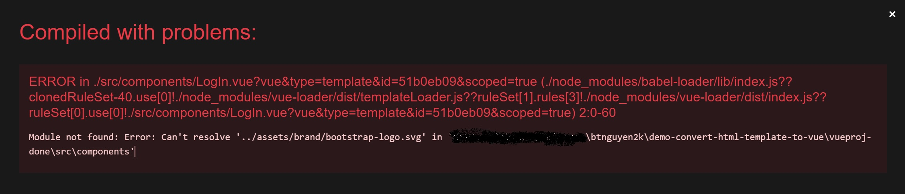

```bs-alert warning flex
<i class="bi bi-translate me-3"></i>
[[do-tag vi_only]]
```

Bạn bắt đầu một dự án Vue mới và tìm thấy một chiếc template rất thích hợp cho dự án của mình. Nhưng cái template này ở dạng HTML, không đem về "cắm thẳng" vào dự án Vue của bạn là chạy được, mà bạn cần phải chuyển đổi nó sang Vue component mới có thể sử dụng. Bài viết này hướng dẫn từng bước chuyển đổi một template HTML thành Vue component để sử dụng.

Giả thuyết rằng bạn đã quen thuộc với Vue và thoải mái làm việc với HTML/CSS/Javascript cũng như các công cụ liên quan như `npm`. Chúng ta sẽ chuyển 1 [trang đăng nhập được thiết kế bằng Bootstrap](https://getbootstrap.com/docs/5.3/examples/sign-in/) sang Vue component. Trang đăng nhập này thiết kế giao diện sử dụng _Bootstrap 5_, bao gồm _1 trang HTML_, _1 tập tin CSS_ và _1 tập tin javascript_. Khi bạn đã nắm được công thức chuyển đổi từ 1 trang HTML sang 1 Vue component thì việc chuyển đổi 1 template HTML có nhiều trang sang Vue component cũng sẽ không làm khó bạn.

```bs-alert info

Bạn có thể download mã nguồn đầy đủ của template HTML gốc và sau khi chuyển đổi thành Vue component ở [GitHub repo này](https://github.com/btnguyen2k/demo-convert-html-template-to-vue).
```

## 0. Tạo dự án Vue

Để đơn giản, ta sẽ [tạo mới 1 dự án Vue 3](https://cli.vuejs.org/guide/creating-a-project.html) với lệnh `vue create`. Sau khi tạo thành công, bạn sẽ có một dự án Vue "hello world" với một component tên là `HelloWorld` lưu trong tập tin `src/components/HelloWorld.vue`.

Vì chúng ta đang chuyển 1 trang đăng nhập từ HTML sang Vue component nên sẽ rất hợp lý nếu chúng ta tạo 1 component tên là `LogIn` và lưu trong tập tin `src/components/LogIn.vue`. Hiện tại do chúng ta chưa bắt đầu công việc chuyển đổi nên tập tin `LogIn.vue` chỉ có nội dung như thế này

```html
<template>
    <div>//TODO</div>
</template>

<style scoped>
</style>


<script>
export default {
    name: 'LogIn',
}
</script>
```

Chúng ta cũng cần chỉnh lại nội dung file `src/App.vue` lại một chút như sau:
```bs-tabs
    [[bs-tab App.vue mới
    ```html
    <template>
        <LogIn />
    </template>

    <script>
    import LogIn from './components/LogIn.vue'

    export default {
        name: 'App',
        components: {
            LogIn
        }
    }
    </script>

    <style>
    #app {
    ...
    ```
    ]]

    [[bs-tab App.vue cũ
    ```html
    <template>
        
        <HelloWorld msg="Welcome to Your Vue.js App"/>
    </template>

    <script>
    import HelloWorld from './components/HelloWorld.vue'

    export default {
        name: 'App',
        components: {
            HelloWorld
        }
    }
    </script>

    <style>
    #app {
    ...
    ```
    ]]
```

Cấu trúc cây dự án Vue của chúng ta sẽ tương tự như sau:
```
vueproj/
├── README.md
├── babel.config.js
├── jsconfig.json
├── package-lock.json
├── package.json
├── public
│   ├── favicon.ico
│   └── index.html
├── src
│   ├── App.vue                   <-- nhớ cập nhật tập tin này để import component LogIn vừa tạo
│   ├── assets
│   │   └── logo.png
│   ├── components
│   |   ├── LogIn.vue             <-- component LogIn chúng ta vừa thêm vào
│   │   └── HelloWorld.vue        <-- có thể xoá component này
│   └── main.js
└── vue.config.js
```

```bs-alert primary

Lưu ý: nhớ đặt tên component là `LogIn` và tên tập tin là `LogIn.vue` (chữ `I` hoa!). Nếu bạn đặt tên là `Login` (chữ `i` thường) thì Vue có thể báo lỗi biên dịch: `Component name "Login" should always be multi-word  vue/multi-word-component-names`.
```

## 1. Xác định các thành phần cần chuyển đổi

Về cơ bản, các thành phần sau của template HTML sẽ cần phải chuyển đổi sang Vue:


## 2. Các thư viện bên thứ 3

Chuyển đổi và tích hợp các thư viện của bên thứ 3 vào Vue nói khó thì không khó mà nói dễ thì cũng không dễ. Nhưng kết quả chuyển đổi thành công hay thất bại lại đóng vài trò then chốt trong việc quyết định bạn có sử dụng được cái HTML template hay không. Nếu thư viện bên thứ 3 có plug-in tương thích với phiên bản Vue bạn đang sử dụng: chúc mừng bạn. Còn trong trường hợp ngược lại: xin chia buồn bạn đã quay vào ô mất lượt! Khi thư viện bên thứ 3 không có sẵn ở dạng plug-in cho phiên bản Vue bạn sử dụng thì tìm một chiếc template khác thường sẽ là phương án khả thi hơn nhiều so với việc tự mày mò hoặc thuê/nhờ người khác viết plug-in.

Bạn cũng đừng quá lo lắng, Vue là 1 framework nổi tiếng. Các thư viện Javascript phổ biến đều có plug-in cho Vue. Trang đăng nhập mà chúng ta sử dụng trong bài viết này sử dụng thư viện bên thứ 3 là _Bootstrap 5_. Đầu tiên chúng ta sẽ tiến hành cài đặt _Bootstrap_ và _Bootstrap icons_ thông qua 2 lệnh sau:
```sh
$ npm install bootstrap -S

# Có thể chỉ định cài đặt cụ thể phiên bản Bootstrap
$ npm install bootstrap@5.3.0-alpha3 -S
```

và
```s
$ npm i bootstrap-icons -S
```

Kế tiếp, import Bootstrap trong phần `<style>` của tập tin `src/App.vue`:
```html
<style lang="css">
/* Bootstrap 5.x */
@import "bootstrap/dist/css/bootstrap.min.css";
@import "bootstrap";
@import "bootstrap-icons";

...
</style>
```

Và cuối cùng, mặc dù template sử dụng trong bài viết này không sử dụng các thành phần khác của Bootstrap nhưng trong các dự án thực tế sẽ là một ý tưởng không tệ nếu bạn khai báo các thành phần Bootstrap ở một nơi chung và sử dụng trong các component khác nhau trong dự án. Chúng ta khai báo các thành phần Bootstrap được sử dụng trong tập tin `src/main.js` như sau:

```js
const app = createApp(App)

...

// Start: enable Bootstrap components
import {Alert,Button,Carousel,Collapse,Dropdown,Modal,Offcanvas,Popover,ScrollSpy,Tab,Toast,Tooltip} from 'bootstrap'
app.component(Alert)
app.component(Button)
app.component(Carousel)
app.component(Collapse)
app.component(Dropdown)
app.component(Modal)
app.component(Offcanvas)
app.component(Popover)
app.component(ScrollSpy)
app.component(Tab)
app.component(Toast)
app.component(Tooltip)
// End

...

app.mount('#app')
```

```bs-alert primary

Trong vài dự án Vue, bạn có thể gặp kiểu viết tắt như sau: `createApp(App).mount('#app')`. Hãy tách phần khởi tạo `App` và mount `#app` thành 2 câu lệnh riêng, chẳng hạn như `const app = createApp(app)` và `app.mount('#app')`. Làm như vậy sẽ tiện hơn rất nhiều khi bạn cần thực thi các phần cấu hình khác với ứng dụng (ví dụ như import các plug-in).
```

## 3. Mã HTML của template

Quá trình chuyển đổi mã HTML sang Vue component khá là trực tiếp: copy phần mã HTML đặt vào giữa thẻ `<template>` và `</template>`. Nhớ lưu ý một số điểm sau:

**Copy phần HTML nằm giữa `<body>` và `</body>`.** Không copy các phần HTML nằm ngoài, ví dụ như phần trong `<head>`.

**Chỉ có duy nhất 1 thẻ nằm ở cấp độ cao nhất trong template.** Nếu có hơn 2 thẻ, dạng như
```html
<template>
    <h1>Đây là tiêu đề</h1>
    <p>Đây là nội dung</p>
</template>
```

thì Vue sẽ báo lỗi `The template root requires exactly one element.` Do vậy, bạn hãy bao 1 thẻ `div` ở bên ngoài để cấp độ cao nhất chỉ còn lại 1 thẻ:
```html
<template>
    <div>
        <h1>Đây là tiêu đề</h1>
        <p>Đây là nội dung</p>
    </div>
</template>
```

**Chuyển các CSS nhúng** đặt riêng vào phần `<style scoped>...</style>` trong Vue component. Các CSS nhưng là các phần CSS nằm giữa thẻ `<style>` và `</style>` trong trang HTML gốc. Lưu ý: các CSS nhúng này thường được khai báo trong phần `<head>` nhưng thỉnh thoảng cũng có thể được khai báo trong `<body>`. Nhớ đừng bỏ sót đoạn nào. Lúc này tập tin `LogIn.vue` của chúng ta sẽ có nội dung tương tự như sau:
```html
<template>
    <div>
        ...
    </div>
</template>

<style scoped>
.bd-placeholder-img {
    font-size: 1.125rem;
    text-anchor: middle;
    -webkit-user-select: none;
    -moz-user-select: none;
    user-select: none;
}
...
</style>

<script>
export default {
    name: 'LogIn',
}
</script>
```

**Giữ nguyên các CSS dạng inline** (ví dụ `<p style="font-size: small">`), bỏ các tập tin _CSS của bên thứ 3_ (ở đây là Bootstrap) vì chúng ta đã xử lý ở bước số (2) bên trên, các phần _Javascript_ inline, nằm trong thẻ `<script>` hoặc trong các file `.js` bên ngoài cũng cần lược bỏ, chúng ta sẽ xử lý Javascript sau.

Tới bước này, nếu bạn chạy dự án Vue thì có thể sẽ gặp lỗi như sau:

 
 Đừng quá lo lắng, chúng ta sẽ xử lý lỗi này và tạo ra một trang web chạy được trong các phần tiếp theo.

 ## 4. CSS, Javascript và các tập tin media của template

 Ngoài các CSS, Javascript và tập tin media của các thư viện của bên thứ 3, template HTML cũng có thể có CSS, Javascript và tập tin media riêng. Cụ thể, template HTML dùng làm ví dụ trong bài viết này sử dụng các tập tin bên ngoài `sign-in.css`, `color-modes.js` và `bootstrap-logo.svg`. Chúng ta sẽ **qui hoạch các tập tin này vào thư mục `src/assets`**:
 ```
vueproj/
├── src
│   ├── assets
│   │   ├── css
│   │   │   └── sign-in.css               <-- các tập tin CSS đưa vào thư mục css
│   │   ├── images
│   │   │   └── bootstrap-logo.svg        <-- các tập tin hình ảnh đưa vào thư mục images
...
```

```bs-alert primary

Lưu ý là tâp tin `color-modes.js` chúng ta không đưa vào thư mục `src/assets`. Javascript là phần chúng ta sẽ xử lý sau cùng.
```

```bs-alert info

- Trong các dự án thực tế, ngoài CSS và tập tin hình ảnh, các tập tin media khác (như font chữ) cũng có thể qui hoạch vào thư mục `src/assets`.
- Bạn cũng có thể tách phần CSS nhúng trong thẻ `<style>` ra các tập tin riêng thay vì để trong tập tin `.vue` nếu muốn.
```

Trước khi kết thúc qui hoạch, bạn hãy kiểm tra các tập tin trong thư mục `src/assets` để đảm bảo rằng tham chiếu đến các tập tin là đúng. Chẳng hạn như trong tập tin CSS có tham chiếu `background-image: url('background.jpg')`, hãy đảm bảo rằng đường dẫn tới tập tin `background.jpg` là đúng.

## 5. Cập nhật HTML lần cuối

Component Vue của chúng ta vẫn còn lỗi và chưa chạy được cho tới hiện tại. Sau khi qui hoạch thư mục `src/assets`, chúng ta hãy quay lại xử lý hết các phần việc cuối cùng bao gồm sửa các lỗi này và các Javascript.

Quay lại với tập tin `LogIn.vue` và **cập nhật các tham chiếu đến các tập tin media**. Trong HTML template mà chúng ta sử dụng cho bài viết này chỉ có 1 tham chiếu cần cập nhật. Bạn tìm đến dòng chứa đoạn `` và cập nhật lại thành ``

Chúng ta cũng cần import các tập tin CSS. Thêm dòng `@import "@/assets/css/sign-in.css";` vào phần thẻ `<style scoped>` của tập tin `LogIn.vue` như sau:
```html
<style scoped>
@import "@/assets/css/sign-in.css";

.bd-placeholder-img {
    font-size: 1.125rem;
    text-anchor: middle;
    -webkit-user-select: none;
    -moz-user-select: none;
    user-select: none;
}
...
</style>
```

Tới đây chúng ta đã có được kết quả tương đối:
```bs-cards lightbox=result
    [[bs-card border=primary
    -img:result-1.jpg
    ]]
```

Kế tiếp, chúng ta cần canh giữa form vào giữa màn hình như template HTML gốc. Để làm điều nay, ta thêm `class="vw-100"` vào thẻ `div` trên cùng như sau:
```bs-tabs
    [[bs-tab LogIn.vue mới
    ```html
    <template>
        <div class="vw-100">
            <svg xmlns="http://www.w3.org/2000/svg" style="display: none;">
    ...
    ```
    ]]

    [[bs-tab LogIn.vue cũ
    ```html
    <template>
        <div>
            <svg xmlns="http://www.w3.org/2000/svg" style="display: none;">
    ...
    ```
    ]]
```

Lúc này thì kết quả đã gần ổn rồi:
```bs-cards lightbox=result
    [[bs-card border=primary
    -img:result-2.jpg
    ]]
```

Bước cuối cùng, chúng ta xử lý Javascript để trình đơn chọn màu ở góc phải bên dưới hoạt động. Bạn có nhớ là còn 1 tập tin `color-modes.js` chúng ta chưa đụng đến? Giờ là lúc mở tập tin này ra rồi, đoạn Javascript xử lý trình đơn chọn màu góc phải bên dưới nằm trong tập tin này.

Chúng ta sẽ chuyển đoạn mã Javascript này vào phần `mounted` của tập tin `LogIn.vue`:
```html
<script>
export default {
    name: 'LogIn',
    mounted() {
        /* copy đoạn mã Javascript trong tập tin `color-modes.js` vào đây */
    }
}
```

Và chúng ta có kết quả mĩ mãn:
```bs-cards lightbox=result
    [[bs-card border=primary
    -img:result-3.jpg
    ]]
```

Mã nguồn của template HTML cùng với kết quả dự án Vue sau khi chuyển đổi có trên GitHub tại địa chỉ https://github.com/btnguyen2k/demo-convert-html-template-to-vue

```bs-alert info

Template HTML mà chúng ta chọn trong bài viết này không có các inline event dạng `onClick=...`.
Trong các dự án thực tế, nếu gặp các inline event, bạn có thể đặt các hàm Javascript xử lý event trong phần `methods` của Vue component và tham chiếu đến chúng.
```

## Trước khi kết thúc

Như vậy chúng ta đã đi qua các bước chi tiết để chuyển đổi một template HTML thành Vue component. Tóm tắt lại, chúng ta sẽ có các điểm lưu ý:
- **Các thư viện bên thứ 3**: thư viện bên thứ 3 có hỗ trợ và tương thích với phiên bản Vue bạn sử dụng là điều kiện quan trọng nhất quyết định tiếp tục chuyển đổi template HTML thành Vue component để sử dụng hay là tìm một template khác.
- **Qui hoạch các tập tin CSS và media** vào tuhw mục `src/assets`. Cập nhật các tham chiếu đến các tập tin nếu cần thiết.
- **Chuyển đổi phần HTML** bằng cách copy qua tập tin `.vue` và đặt vào giữa thẻ `<template>`:
  - CSS có thể đặt trong thẻ `<style>` trong tập tin `.vue` hoặc dời sang tập tin CSS bên ngoài.
  - Các CSS dùng chung cho toàn bộ các Vue component của dự án có thể được khai báo hoặc import một lần trong tập tin `src/App.vue`.
- **Viết lại các Javascript**, kể cả các đoạn xử lý event. Bạn không nhất thiết phải copy y nguyên các Javascript. Mà hãy _viết lại_ theo qui chuẩn của Vue.

<hr/>

_[[do-tag ghissue_comment.vi]]_
