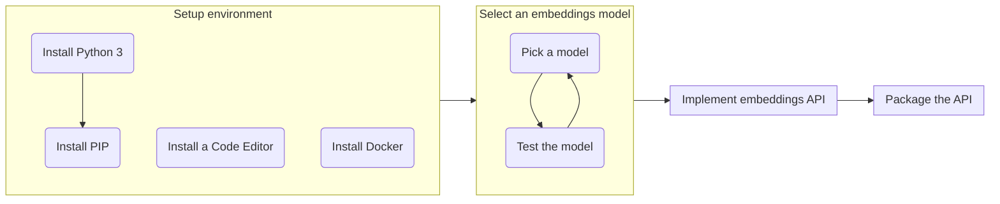

If you are planning to develop a [semantic search system utilizing embeddings vectors]((../../openai/semantic-search-openai-embeddings/)), the ability to extract embeddings from the input is of utmost importance in such an application. OpenAI offers an outstanding API for this purpose, known as the [OpenAI Embeddings API](https://platform.openai.com/docs/api-reference/embeddings). However, there may be certain situations where you need to deploy a private embedding API within your own environment:
- Corporate Policies: In some cases, policies may prohibit the transmission of data outside the corporate network.
- Custom Embedding Model: you require a specialized embedding model that is specifically tailored to your own data.
- Cost Optimization: Another reason to consider deploying a private embedding API is to optimize costs<sup>[1]</sup>.

```bs-alert info

[1] As of the publication date of this post, the [pricing](https://openai.com/pricing#embedding-models) for the OpenAI Embeddings API ranges from approximately \$0.0001 to \$0.2000 per 1000 tokens.
```

This technical guide provides a comprehensive, step-by-step walkthrough for building your own embeddings API that can be deployed in your private environment. The following summarizes the key steps covered in this guide:



## Setup environment

The embeddings API will be implemented in Python programming language. Therefore, it is necessary to install [Python 3](https://www.python.org/downloads/) and [pip](https://pip.pypa.io/en/stable/installation/) in your environment. Even if you are not well-versed in Python development, implementing an embeddings API in Python is relatively straightforward. Simply ensure that you have successfully installed the Python environment and follow the step-by-step instructions provided in this guide.

You will also need an IDE or a code editor that supports Python syntax. There are several options available, including lightweight and free IDEs/code editors. Some recommended choices are:
- [Visual Studio Code](https://code.visualstudio.com/): A popular and feature-rich IDE that provides excellent support for Python development.
- [VIM](https://www.vim.org/): A powerful and customizable text editor that is widely used in the programming community. It can be configured to support Python syntax highlighting and other useful features.
- [Notepad++](https://notepad-plus-plus.org/): A lightweight and user-friendly code editor that supports various programming languages, including Python.

Feel free to select the IDE or code editor that suits your preferences and requirements.

To simplify the distribution and management of the API, we will package it as a Docker image. Therefore, it is necessary to have Docker installed. Note that this step is optional and can be skipped if desired.

```bs-alert primary

If you are using Windows, it is highly recommended to utilize the [Windows Subsystem for Linux](https://learn.microsoft.com/en-us/windows/wsl/).
```

## Select an embeddings model

Once you have setup the environment, the next step is choosing an appropriate embeddings model. In this guide, we will utilize models offered by [Sentence Transformers](https://huggingface.co/sentence-transformers). Sentence Transformers provides a selection of pre-trained models specifically designed for generating embeddings. These models have been trained on various tasks and datasets, enabling them to capture rich semantic representations of text.

The first step involves installing the necessary library:

**venv**: this module is optional but highly recommended. By using `venv`, you can create a dedicated Python virtual environment dedicated for developing the embeddings API. This allows for better isolation and management of dependencies.

```shell
$ pip install venv
$ python -m venv myenv
$ source myenv/bin/activate
(myenv)$
```
**transformers and torch**: are the two primary libraries required to utilize Sentence Transformers models.

```shell
(myenv)$ pip install transformers torch
```

```bs-alert warning flex
<i class="me-3 bi bi-exclamation-triangle"></i>
Other dependencies will also be downloaded and installed. It is important to note that the total size of these downloads is quite substantial. Therefore, while the installation process is underway, it is a good time to relax, grab a cup of coffee, and patiently wait for the installation to complete.
```

After the installation process is finished, you are ready to explore the capabilities of Sentence Transformers models. One advantage of Python is that you don't need to write the entire source code to execute the application. Python lets you to run individual code statements within its interpreter environment. To begin, let's initiate the Python interpreter environment by executing the following command:

```shell
(myenv)$ python
Python 3.8.10 (default, Mar 13 2023, 10:26:41)
[GCC 9.4.0] on linux
Type "help", "copyright", "credits" or "license" for more information.
>>>
```

```bs-alert primary flex
<i class="me-0 bi bi-info-circle"></i>
- The displayed info message may vary depending on the version of Python you have installed.
- On certain operating systems, you might need to use the command `python3` instead of `python`.
- Once you enter the Python interpreter environment, the command prompt will change to `>>>`.
```

Let's try out the pre-trained model `all-MiniLM-L6-v1` provided by Sentence Transformers. Copy the following source code and paste it into the Python's `>>>` command prompt:

```python
from transformers import AutoTokenizer, AutoModel
import torch
import torch.nn.functional as F

#Mean Pooling - Take attention mask into account for correct averaging
def mean_pooling(model_output, attention_mask):
    token_embeddings = model_output[0] #First element of model_output contains all token embeddings
    input_mask_expanded = attention_mask.unsqueeze(-1).expand(token_embeddings.size()).float()
    return torch.sum(token_embeddings * input_mask_expanded, 1) / torch.clamp(input_mask_expanded.sum(1), min=1e-9)

#Load model from HuggingFace Hub
model_name = "sentence-transformers/all-MiniLM-L6-v1"
tokenizer = AutoTokenizer.from_pretrained(model_name)
model = AutoModel.from_pretrained(model_name)
```

```bs-alert warning flex
<i class="me-3 bi bi-exclamation-triangle"></i>
Certain models have a significant download size, and downloading them for the first time can take a considerable amount of time.
```

Once the model has been successfully downloaded and initialized, we can utilize the model to extract the embeddings vector from a text input. Copy the following source code and paste it into the Python's `>>>` command prompt:

```python
# Two input text sentences to extract embedding vectors
sentences = ['I feel extremely chilly', 'I am so cold']

# Extract embedding vectors
encoded_input = tokenizer(sentences, padding=True, truncation=True, return_tensors='pt')
with torch.no_grad():
    model_output = model(**encoded_input)

sentence_embeddings = mean_pooling(model_output, encoded_input['attention_mask'])
sentence_embeddings = F.normalize(sentence_embeddings, p=2, dim=1)

# Print the result to console
print("Sentence embeddings:")
print(sentence_embeddings)
```

The `print(sentence_embeddings)` statement will display an output similar to the following on the console:
```python
tensor([[-3.3823e-02,  6.4573e-03,  2.2603e-02,  8.3722e-02,  5.9714e-02,
         -5.4969e-02,  4.8598e-02,  5.7921e-02, -3.4679e-02, -1.8498e-02,
            # ...alot of numbers here
         -4.8426e-02, -1.0834e-01, -1.4798e-01, -2.1878e-02],
        [-4.4593e-02, -1.9920e-02,  3.0846e-02,  6.5594e-02,  9.2603e-02,
            # ...alot of numbers here
         -2.6462e-02, -1.2433e-01, -1.0379e-01, -6.9548e-03]])
```

Since we have obtained the two embeddings vectors, let's calculate their `cosine similarity` value:
```python
import numpy as np
from numpy.linalg import norm

A = sentence_embeddings[0]
B = sentence_embeddings[1]
cosine = np.dot(A,B)/(norm(A)*norm(B))
print("Cosine Similarity:", cosine) # Cosine Similarity: 0.7185844
```

To explore other models, you can modify the line `model_name = "..."` with the desired model name and rerun the aforementioned source code. You can refer to the list of pre-trained models offered by Sentence Transformers [here](https://www.sbert.net/docs/pretrained_models.html) or [here](https://huggingface.co/sentence-transformers).
Additionally, you can also change the input text by modifying the line `sentences = [...]` with your desired sentences. Feel free to experiment with different models and input texts to observe varying results.

## Implement embeddings API

Once you have selected a satisfactory model, we can proceed with implementing an API that accepts an input text and returns the extracted embeddings vector.

To begin, we need to install additional necessary libraries to support our API implementation.

```shell
(myenv)$ pip install fastapi uvicorn[standard]
```

Next, create a source code file named `main.py` and populate it with the following content:

```python
from transformers import AutoTokenizer, AutoModel
import torch
import torch.nn.functional as F
from fastapi import FastAPI
from pydantic import BaseModel

#Mean Pooling - Take average of all tokens
def mean_pooling(model_output, attention_mask):
    token_embeddings = model_output.last_hidden_state #First element of model_output contains all token embeddings
    input_mask_expanded = attention_mask.unsqueeze(-1).expand(token_embeddings.size()).float()
    return torch.sum(token_embeddings * input_mask_expanded, 1) / torch.clamp(input_mask_expanded.sum(1), min=1e-9)

#Load model from HuggingFace Hub
model_name = "sentence-transformers/all-MiniLM-L6-v1"
tokenizer = AutoTokenizer.from_pretrained(model_name)
model = AutoModel.from_pretrained(model_name)

#Init API application server
app = FastAPI()

class EmbeddingsRequest(BaseModel):
    input: str

@app.post("/embeddings")
async def api_embeddings(req: EmbeddingsRequest):
    encoded_input = tokenizer([req.input], padding=True, truncation=True, return_tensors='pt')
    with torch.no_grad():
        model_output = model(**encoded_input)

    sentence_embeddings = mean_pooling(model_output, encoded_input['attention_mask'])
    sentence_embeddings = F.normalize(sentence_embeddings, p=2, dim=1)
    return sentence_embeddings[0].tolist()

import uvicorn
if __name__ == "__main__":
    uvicorn.run(app, host="0.0.0.0", port=8000)
```

Start our API with the following command:

```shell
(myenv)$ python main.py
INFO:     Started server process [512]
INFO:     Waiting for application startup.
INFO:     Application startup complete.
INFO:     Uvicorn running on http://0.0.0.0:8000 (Press CTRL+C to quit)
```

After initiation, our API will be available at http://localhost:8000/embeddings.

```shell
$ curl http://localhost:8000/embeddings \
  -H "Content-Type: application/json" \
  -d '{
    "input": "The food was delicious and the waiter..."
  }'

[-0.008277260698378086,0.08216527104377747,0.027991190552711487,0.04848009720444679,-0.08307256549596786,
#...alot of numbers here
0.04311569407582283,0.008442593738436699,0.04377822205424309,-0.020074445754289627,-0.049872614443302155]
```

## Package the API

The final step involves packaging our API as a Docker image for seamless distribution and deployment across different environments. To begin, create a file named `requirements.txt` and include the following content within it:

```
transformers==4.30.2
torch==2.0.1
tiktoken==0.4.0
fastapi==0.97.0
uvicorn[standard]==0.22.0
```

Next, create a file named `Dockerfile` and populate it with the following content:

```dockerfile
# Sample build command:
# $ docker build --rm -t txapi .

FROM python:3.9-slim
RUN mkdir -p /workspace
ADD requirements.txt /workspace
ADD main.py /workspace
RUN cd /workspace && python -m venv myenv && bash -c 'source myenv/bin/activate && pip install -U -r requirements.txt'
WORKDIR /workspace
EXPOSE 8000
CMD ["bash", "-c", "source myenv/bin/activate && python main.py"]
```

To build the Docker image, use the following command as an example:

```shell
$ docker build --rm -t txapi .
```

## Before we wrap up

In conclusion, we have completed a comprehensive step-by-step technical guide for implementing our own embeddings API. By carefully selecting a suitable model, we can construct an embeddings API that is well-suited for production applications.

The completed source code utilized in this guide is available on the following GitHub repository: btnguyen2k/txapi.

<hr/>

```bs-alert warning

Disclaimer: I utilized ChatGPT to proofread and rephrase certain sections of this post.
```

_[[do-tag ghissue_comment.en]]_
