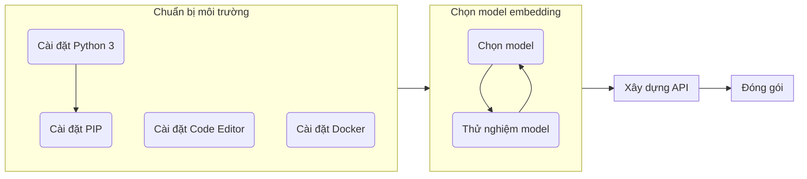

Nếu bạn có kế hoạch thiết kế 1 hệ thống [tìm kiếm ngữ nghĩa sử dụng embedding vec-tơ](../../openai/semantic-search-openai-embeddings/), trích xuất embedding vec-tơ từ đầu vào sẽ là 1 bước quan trọng không thể thiếu để xây dựng lên thống. OpenAI cung cấp một [API xuất sắc](https://platform.openai.com/docs/api-reference/embeddings) để thực hiện tác vụ đó. Tuy nhiên, trong một số trường hợp, bạn có thể phát sinh nhu cầu triển khai 1 API tương tự bên trong môi trường riêng của bạn:
- Qui định của doanh nghiệp không cho phép bạn gởi dữ liệu ra hệ thống bên ngoài.
- Bạn cần 1 model embedding tuỳ chỉnh riêng, thích hợp hơn cho dữ liệu của riêng bạn.
- Bạn muốn tối ưu chi phí<sup>[1]</sup>.

```bs-alert info

[1] Vào thời điểm đăng bài viết, OpenAI [tính giá](https://openai.com/pricing#embedding-models) từ \$0.0001 đến \$0.2000 cho 1000 token.
```

Bài viết này hướng dẫn bạn từng bước xây dựng một embedding API, có thể triển khai được trong môi trường của riêng bạn. Các bước trình bày trong bài viết được tóm tắt như sau:



## Chuẩn bị môi trường

Chúng ta sẽ xây dựng embeding API bằng ngôn ngữ lập trình Python. Do vậy bạn cần cài đặt [Python 3](https://www.python.org/downloads/) và [pip](https://pip.pypa.io/en/stable/installation/) lên máy của bạn. Đừng lo lắng nếu bạn không biết lập trình với Python. Toàn bộ qui trình xây dựng embedding API của bài viết này khá đơn giản, bạn chỉ cần cài đặt thành công Python lên máy và làm theo các hướng dẫn trong bài viết là sẽ ổn.

Kế tiếp, bạn cần 1 IDE hỗ trợ Python, hoặc đơn giản chỉ cần 1 chương trình soạn thảo văn bản hỗ trợ cú pháp Python. [Visual Studio Code](https://code.visualstudio.com/), [VIM](https://www.vim.org/) hoặc [Notepad++](https://notepad-plus-plus.org/) là các IDE/trình soạn thảo nhỏ nhẹ và hoàn toàn miễn phí cho bạn sử dụng.

(Bước này là tuỳ chọn) Để tiện cho việc đóng gói và triển khai API, chúng ta sẽ đóng gói API ở dạng Docker image. Như vậy bạn sẽ cần cài đặt Docker lên máy của bạn.

```bs-alert primary

Nếu bạn dùng Windows, khuyến nghị bạn nên sử dụng [Windows Subsystem for Linux](https://learn.microsoft.com/en-us/windows/wsl/).
```

## Chọn embedding model

Sau khi bạn đã cài đặt xong các công cụ cần thiết, bước kế tiếp là lựa chọn 1 embedding model thích hợp cho nhu cầu của bạn. Bài viết này sử dụng model của [Sentence Transformers](https://huggingface.co/sentence-transformers). Sentence Transformers cung cấp khá nhiều model đã được train sẵn cho nhu cầu trích xuất embedding.

Trước tiên, chúng ta hãy cài đặt các thư viện cần thiết:

**venv**: không bắt buộc, nhưng khuyến nghị bạn bên cài module `venv` và tạo 1 virtual environment dành riêng cho phần trải nghiệm này:

```shell
$ pip install venv
$ python -m venv myenv
$ source myenv/bin/activate
(myenv)$
```

**transformers và torch**: 2 thư viện chính để sử dụng các model.

```shell
(myenv)$ pip install transformers torch
```

```bs-alert warning flex
<i class="me-3 bi bi-exclamation-triangle"></i>
Các thư viện liên quan cũng sẽ được tự động tải về và cài đặt. Tổng dung lượng cần tải về tương đối lớn, toàn bộ quá trình cài đặt sẽ cần 1 khoản thời gian tương đối. Bạn có thể để máy đó và đi pha 1 cốc cà phê trong lúc chờ đợi.
```

Sau khi quá trình cài đặt hoàn tất, chúng ta có thể bắt đầu thử nghiệm các model của Sentence Transformers. Một điểm hay của Python là bạn không nhất thiết phải viết 1 chương trình hoàn chỉnh rồi mới có thể chạy. Python cho phép bạn chạy từng dòng lệnh trong môi trường thông dịch của mình. Để bắt đầu, bạn hãy vào môi trường thông dịch của Python bằng câu lệnh sau:

```shell
(myenv)$ python
Python 3.8.10 (default, Mar 13 2023, 10:26:41)
[GCC 9.4.0] on linux
Type "help", "copyright", "credits" or "license" for more information.
>>>
```

```bs-alert primary flex
<i class="me-0 bi bi-info-circle"></i>
- Tuỳ vào phiên bản Python bạn cài đặt, thông tin hiển thị trên máy bạn có thể khác đôi chút.
- Trên 1 số hệ điều hành, bạn có thể cần chạy lệnh `python3` thay vì `python`.
- Sau khi vào môi trường thông dịch của Python thành công, dấu nhắc lệnh sẽ chuyển thành `>>>`.
```

Kế tiếp, chúng ta hãy thử nghiệm model `all-MiniLM-L6-v1` của Sentence Transformers. Copy đoạn mã sau và dán vào dấu nhắc lệnh `>>>` của Python:

```python
from transformers import AutoTokenizer, AutoModel
import torch
import torch.nn.functional as F

#Mean Pooling - Take attention mask into account for correct averaging
def mean_pooling(model_output, attention_mask):
    token_embeddings = model_output[0] #First element of model_output contains all token embeddings
    input_mask_expanded = attention_mask.unsqueeze(-1).expand(token_embeddings.size()).float()
    return torch.sum(token_embeddings * input_mask_expanded, 1) / torch.clamp(input_mask_expanded.sum(1), min=1e-9)

#Load model from HuggingFace Hub
model_name = "sentence-transformers/all-MiniLM-L6-v1"
tokenizer = AutoTokenizer.from_pretrained(model_name)
model = AutoModel.from_pretrained(model_name)
```

```bs-alert warning flex
<i class="me-3 bi bi-exclamation-triangle"></i>
Một số model có dung lượng tương đối lớn. Lần đầu tiên tải model sẽ mất một ít thời gian.
```

Sau khi model được tải thành công, chúng ta sẽ thử dùng model tính embedding vec-tơ của đoạn văn bản đầu vào. Tương tự, hãy copy đoạn mã sau và dán vào dấu nhắc lệnh `>>>` của Python:

```python
# Hai câu văn bản dùng để tính embedding vec-tơ
sentences = ['I feel extremely chilly', 'I am so cold']

# Tính embedding vec-tơ
encoded_input = tokenizer(sentences, padding=True, truncation=True, return_tensors='pt')
with torch.no_grad():
    model_output = model(**encoded_input)

sentence_embeddings = mean_pooling(model_output, encoded_input['attention_mask'])
sentence_embeddings = F.normalize(sentence_embeddings, p=2, dim=1)

# In kết quả ra màn hình
print("Sentence embeddings:")
print(sentence_embeddings)
```

Sau câu lệnh `print(sentence_embeddings)`, kết quả trên màn hình của bạn tương tự như sau:
```python
tensor([[-3.3823e-02,  6.4573e-03,  2.2603e-02,  8.3722e-02,  5.9714e-02,
         -5.4969e-02,  4.8598e-02,  5.7921e-02, -3.4679e-02, -1.8498e-02,
            # ...rất nhiều con số ở đây
         -4.8426e-02, -1.0834e-01, -1.4798e-01, -2.1878e-02],
        [-4.4593e-02, -1.9920e-02,  3.0846e-02,  6.5594e-02,  9.2603e-02,
            # ...rất nhiều con số ở đây
         -2.6462e-02, -1.2433e-01, -1.0379e-01, -6.9548e-03]])
```

Sau khi có được 2 embedding vec-tơ, chúng ta thử tính giá trị `cosine similarity` giữa chúng.
```python
import numpy as np
from numpy.linalg import norm

A = sentence_embeddings[0]
B = sentence_embeddings[1]
cosine = np.dot(A,B)/(norm(A)*norm(B))
print("Cosine Similarity:", cosine) # Cosine Similarity: 0.7185844
```

Bạn có thể trải nghiệm các model khác bằng cách thay đổi dòng `model_name = "..."` và chạy lại các đoạn mã ở trên. Danh sách các model của Sentence Transformers bạn có thể tham khảo ở [đây](https://www.sbert.net/docs/pretrained_models.html) hoặc [đây](https://huggingface.co/sentence-transformers).
Bạn cũng hoàn toàn có thể thử nghiệm các dữ liệu đầu vào khác nhau bằng cách thay đổi 2 câu văn bản đầu vào (thay đổi dòng `sentences = [...]`).

## Xây dựng API

Sau khi thử nghiệm và lựa chọn được embedding model phù hợp, chúng ta bắt đầu xây dựng API trích xuất embedding vec-tơ từ 1 văn bản đầu vào.

Đầu tiên, chúng ta cần cài đặt thêm một số thư viện.

```shell
(myenv)$ pip install fastapi uvicorn[standard]
```

Tiếp theo, hãy tạo 1 file tên `main.py` với nội dung như sau:

```python
from transformers import AutoTokenizer, AutoModel
import torch
import torch.nn.functional as F
from fastapi import FastAPI
from pydantic import BaseModel

#Mean Pooling - Take average of all tokens
def mean_pooling(model_output, attention_mask):
    token_embeddings = model_output.last_hidden_state #First element of model_output contains all token embeddings
    input_mask_expanded = attention_mask.unsqueeze(-1).expand(token_embeddings.size()).float()
    return torch.sum(token_embeddings * input_mask_expanded, 1) / torch.clamp(input_mask_expanded.sum(1), min=1e-9)

#Load model from HuggingFace Hub
model_name = "sentence-transformers/all-MiniLM-L6-v1"
tokenizer = AutoTokenizer.from_pretrained(model_name)
model = AutoModel.from_pretrained(model_name)

#Init API application server
app = FastAPI()

class EmbeddingsRequest(BaseModel):
    input: str

@app.post("/embeddings")
async def api_embeddings(req: EmbeddingsRequest):
    encoded_input = tokenizer([req.input], padding=True, truncation=True, return_tensors='pt')
    with torch.no_grad():
        model_output = model(**encoded_input)

    sentence_embeddings = mean_pooling(model_output, encoded_input['attention_mask'])
    sentence_embeddings = F.normalize(sentence_embeddings, p=2, dim=1)
    return sentence_embeddings[0].tolist()

import uvicorn
if __name__ == "__main__":
    uvicorn.run(app, host="0.0.0.0", port=8000)
```

Khởi chạy embedding API bằng dòng lệnh:

```shell
(myenv)$ python main.py
INFO:     Started server process [512]
INFO:     Waiting for application startup.
INFO:     Application startup complete.
INFO:     Uvicorn running on http://0.0.0.0:8000 (Press CTRL+C to quit)
```

API của chúng ta đã sẵn sàng phục vụ ở địa chỉ http://localhost:8000/embeddings

```shell
$ curl http://localhost:8000/embeddings \
  -H "Content-Type: application/json" \
  -d '{
    "input": "The food was delicious and the waiter..."
  }'

[-0.008277260698378086,0.08216527104377747,0.027991190552711487,0.04848009720444679,-0.08307256549596786,
#...rất nhiều con số ở đây
0.04311569407582283,0.008442593738436699,0.04377822205424309,-0.020074445754289627,-0.049872614443302155]
```

## Đóng gói

Bước cuối cùng: chúng ta đóng gói API thành Docker image để có thể dễ dàng triển khai ở nơi khác. Đầu tiên, tạo 1 file đặt tên là `requirements.txt` với nội dung như sau:

```
transformers==4.30.2
torch==2.0.1
tiktoken==0.4.0
fastapi==0.97.0
uvicorn[standard]==0.22.0
```

Và tiếp tục tạo file `Dockerfile` với nội dung như sau:

```dockerfile
# Sample build command:
# $ docker build --rm -t txapi .

FROM python:3.9-slim
RUN mkdir -p /workspace
ADD requirements.txt /workspace
ADD main.py /workspace
RUN cd /workspace && python -m venv myenv && bash -c 'source myenv/bin/activate && pip install -U -r requirements.txt'
WORKDIR /workspace
EXPOSE 8000
CMD ["bash", "-c", "source myenv/bin/activate && python main.py"]
```

Docker image được tạo với câu lệnh sau:

```shell
$ docker build --rm -t txapi .
```

## Trước khi kết thúc

Như vậy chúng ta đã đi qua từng bước xây dựng 1 embedding API của riêng mình. Bằng cách lựa chọn model thích hợp, chúng ta hoàn toàn có thể xây dựng được 1 embedding API sử dụng được trong các dự án thực tế.

Toàn bộ mã nguồn sử dụng trong bài viết bạn có thể tham khảo ở GitHub repo [btnguyen2k/txapi](https://github.com/btnguyen2k/txapi).

<hr >

_[[do-tag ghissue_comment.vi]]_
