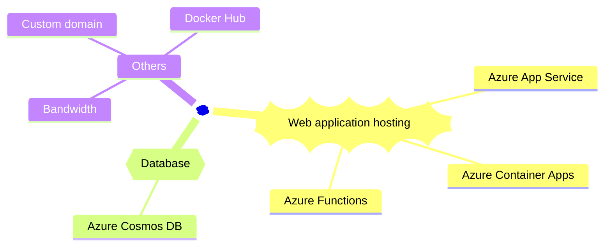
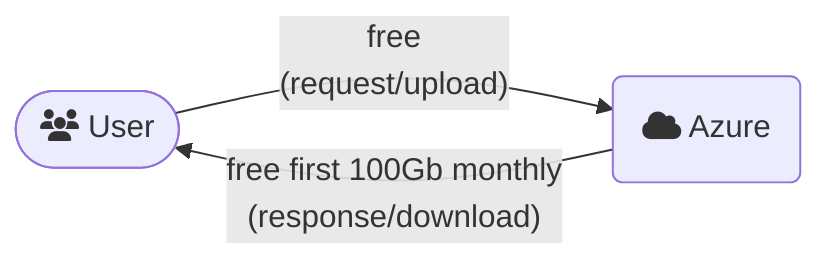

Corporations often prioritize investing in website performance and security as part of their business plan. However, individuals working on personal hobby projects may prefer to explore free hosting services. This post shows you how you can host your website on Azure without incurring any costs.

## Introduction

[Azure](https://azure.microsoft.com/) is a cloud computing platform operated by Microsoft. Azure offers a range of services that are free for the initial 12 months, as well as a selection of always free services<sup>[*]</sup>. This post explores those services that are always free at Azure.

The essential components required to host a typical personal website typically include the following:


## Web application hosting

Azure offers quite a few free services<sup>[*]</sup> that can be used to host your website:

- [**Azure App Service**](https://azure.microsoft.com/pricing/details/app-service/linux/): free with **F1** tier, _1Gb RAM, 1Gb storage, 10 web apps, 60 CPU-minutes per day_. Support Windows and Linux, the website can be deployed as a binary package or container.
- [**Azure Container Apps**](https://azure.microsoft.com/pricing/details/container-apps/): monthly free of _180,000 vCPU-seconds, 360,000 GiB Memory-seconds and 2 million requests_ with **Consumption** plan. The website can be deployed as a container.
- [**Azure Functions**](https://azure.microsoft.com/pricing/details/functions/): monthly free of 1 million requests and 400,000 GB resource-seconds with **Consumption** plan. The website can be deployed as a binary packages or container.

## Database

In scenarios where your website requires database storage, Azure allows _one free Cosmos DB account per subsciprtion_, which includes 1000 RU/s and 25Gb storage capacity at no cost.

[**Azure Cosmos DB**](https://azure.microsoft.com/pricing/details/cosmos-db/) is a NoSQL service available on Azure. It provides compatibility with MongoDB clients, making it a convenient drop-in replacement if your website relies on MongoDB.

For further information about the free tier of Cosmos DB, please refer to [this link](https://learn.microsoft.com/azure/cosmos-db/free-tier).

## Other components

- [**Bandwidth**](https://azure.microsoft.com/pricing/details/bandwidth/): Azure _does not charge ingress data_ and the _first 100Gb of egress data monthly_ is free<sup>[*]</sup>.



```bs-alert primary

It is important to note that the free 100GB egress data allowance is calculated based on all workloads deployed within the Azure subscription, not per individual application.
```

- **[Docker Hub](https://hub.docker.com/)**: if your website is deployed as a container, it will require a service to _host images_. The [Azure Container Registry](https://azure.microsoft.com/pricing/details/container-registry/) service offers _100GB of free storage for the first 12 months_<sup>[*]</sup>. However, since this post focuses on always free services, we will exclude Azure Container Registry from the list. As an alternative, you can utilize Docker Hub for the same purpose<sup>[-]</sup>.

- **Custom domain**: once your website is deployed on an Azure service, users can access it through a URL like https://mpn.whiteisland-8603b684.australiaeast.azurecontainerapps.io. However, this URL may not appear visually appealing. Fortunately, several Azure services enable you to associate a custom domain with your website at no cost. For instance, your website hosted on Azure can have a URL such as https://mpn.btnguyen2k.me. Please note that you will need to purchase the domain name separately.

## Before we wrap up

Azure demonstrates its generosity by providing a range of always free services that are well-suited for hosting personal websites or hobby projects. Additionally, you have the option to leverage free services offered by other providers, including:

- The MongoDB free tier available through [MongoDB Atlas](https://www.mongodb.com/atlas)<sup>[-]</sup>, which offers 500GB of free storage, can be a replacement for Azure Cosmos DB.
- [CloudFlare](https://www.cloudflare.com/)'s free tier<sup>[-]</sup> can be used to cache your website content and reduce bandwidth consumption.

```bs-alert warning

[*] For a completed list of Azure's free services, refer to [this link](https://azure.microsoft.com/pricing/free-services/). Kindly be aware that Azure retains the right to modify their policies and offerings at any given time. The information provided in this post is accurate as of its publication date and is intended for informational purposes only.

[**] Azure Cosmos DB automatically make backups of your database and retains them free of charge for a period of 7 days. However, additional costs may apply if you wish to retain the backups for an extended duration.

[-] Kindly be aware that service providers retains the right to modify their policies and offerings at any given time. The information provided in this post is accurate as of its publication date and is intended for informational purposes only.
```

<hr/>

```bs-alert warning

Disclaimer: I utilized ChatGPT to proofread and rephrase certain sections of this post.
```

_[[do-tag ghissue_comment.en]]_
