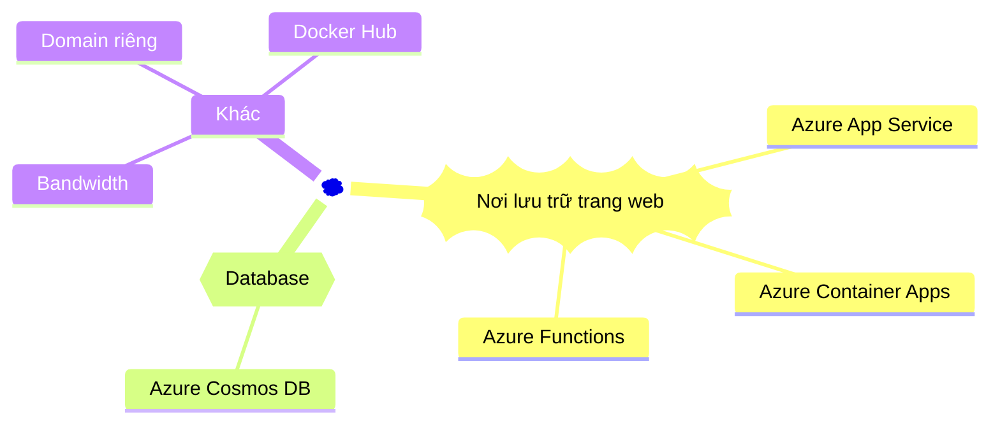
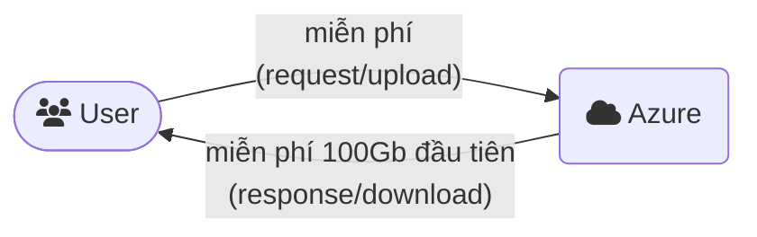

Với doanh nghiệp thì việc đầu tư để vận hành hệ thống web được ổn định và bảo mật thường đã nằm trong kế hoạch kinh doanh. Nhưng với cá nhân, đôi lúc bạn chỉ cần một nơi để lưu trữ trang CV online, hoặc một dự án nhỏ theo sở thích. Bài viết này hướng dẫn cách bạn đưa trang web của bạn lên host trên Azure hoàn toàn miễn phí.

## Giới thiệu

[Azure](https://azure.microsoft.com/) là dịch vụ điện toán đám mây của Microsoft. Azure cung cấp một số dịch vụ miễn phí trong 12 tháng đầu tiên và một số dịch vụ miễn phí trọn đời<sup>[*]</sup>. Bài viết này chỉ xem xét các dịch vụ miễn phí trọn đời của Azure.

Để lưu trữ một trang web cá nhân, thông thường bạn cần các thành phần sau:


## Lưu trữ trang web

Bạn có thể lưu trữ trang web của bạn trên Azure với các dịch vụ miễn phí<sup>[*]</sup> sau:

- [**Azure App Service**](https://azure.microsoft.com/pricing/details/app-service/linux/): miễn phí với plan **F1**, _1Gb RAM, 1Gb storage, 10 web app, 60 phút CPU/ngày_. Hỗ trợ Windows, Linux, triển khai trang web/app dạng binary package hoặc container.
- [**Azure Container Apps**](https://azure.microsoft.com/pricing/details/container-apps/): miễn phí _mỗi tháng 180000 vCPU-second, 360000 GiB Memory-second và 2 triệu request_ với plan **Consumption**. Triển khai trang web/app dạng container.
- [**Azure Functions**](https://azure.microsoft.com/pricing/details/functions/): miễn phí mỗi tháng 1 triệu request và 400000 GB-s resource với plan **Consumption**. Triển khai trang web/app dạng binary package hoặc container.

```bs-alert primary

➡️ Azure Functions không phải là dịch vụ lý tưởng để lưu trữ 1 website, nhưng vẫn thích hợp để triển khai 1 _ứng dụng web dạng API_.

⚠️ Plan _Consumption_ của Azure Functions hiện không hỗ trợ triển khai ứng dụng dạng _container_.

⚠️ _Azure Functions cần đi kèm với dịch vụ Storage_. Do vậy sẽ phát sinh chi phí cho dịch Storage này. Tuy nhiên phần chi phí này khá nhỏ, gần như không đáng kể.
```

## Database

Nếu trang web của bạn cần lưu dữ liệu trong 1 database, Azure cho phép bạn tạo _1 instance Cosmos DB miễn phí trên mỗi subscription_, bao gồm _1000 RU/s và 25 Gb storage_<sup>[**]</sup>.

[**Azure Cosmos DB**](https://azure.microsoft.com/pricing/details/cosmos-db/) là một dịch vụ NoSQL của Azure. Cosmos DB tương thích với client MongoDB. Nếu trang web của bạn sử dụng MongoDB, bạn hoàn toàn có thể sử dụng dịch vụ Cosmos DB của Azure để thay thế.

Xem thêm thông tin về tier miễn phí của Cosmos DB tại [đây](https://learn.microsoft.com/azure/cosmos-db/free-tier).

## Các thành phần khác

- [**Bandwidth**](https://azure.microsoft.com/pricing/details/bandwidth/): Azure _không tính tiền dữ liệu đi vào_ data center của Azure, và _miễn phí 100Gb đầu tiên của dữ liệu đi ra_ mỗi tháng<sup>[*]</sup>.



```bs-alert primary

Lưu ý: 100Gb data miễn phí tính trên _toàn bộ hệ thống bạn triển khai trong subscription_ của Azure, không phải tính riêng theo từng ứng dụng!
```

- **[Docker Hub](https://hub.docker.com/)**: bạn cần 1 nơi để _lưu trữ các image_ nếu trang web của bạn đóng gói dạng container. Dịch vụ [Azure Container Registry](https://azure.microsoft.com/pricing/details/container-registry/) _miễn phí 100Gb trong 1 năm đầu tiên_<sup>[*]</sup>, nhưng vì bài viết này chỉ xem xét các dịch vụ miễn phí trọn đời nên ta sẽ không tính dịch vụ Azure Container Registry vào danh sách. Bạn có thể sử dụng _Docker Hub_ để thay thế<sup>[-]</sup>.

- **Domain riêng**: sau khi đưa trang web của bạn lên 1 trong các dịch vụ của Azure, bạn có thể truy cập vào trang web của bạn qua 1 đường dẫn "xâu xấu" như thế này https://mpn.whiteisland-8603b684.australiaeast.azurecontainerapps.io. Một số dịch vụ của Azure cho phép bạn ánh xạ miễn phí domain của bạn vào trang web (ví dụ: https://mpn.btnguyen2k.me). Nhưng lưu ý rằng, domain bạn có thể phải tốn 1 khoảng chi phí để mua riêng bên ngoài.

## Trước khi kết thúc

Azure khá "rộng rãi" khi cung cấp một số lượng kha khá các dịch vụ miễn phí trọn đời để bạn có thể lưu trữ các dự án web cá nhân như trang CV online, blog cá nhân hoặc một số dự án demo nho nhỏ. Bạn cũng hoàn toàn có thể sử dụng kết hợp thêm với các dịch vụ miễn phí bên ngoài, chẳng hạn như:
- MongoDB free tier<sup>[-]</sup> với 500Mb data của [MongoDB Atlas](https://www.mongodb.com/atlas) thay thế cho Azure Cosmos DB.
- Dịch vụ miễn phí của [CloudFlare](https://www.cloudflare.com/)<sup>[-]</sup> để cache nội dung trang web, giảm lượng bandwidth mà trang web sử dụng.

```bs-alert warning

[*] Xem danh sách các dịch vụ miễn phí của Azure tại [đây](https://azure.microsoft.com/pricing/free-services/). Lưu ý rằng Azure có thể thay đổi chính sách và các dịch vụ bất cứ lúc nào. Các thông tin trong bài viết chỉ đúng tại thời điểm đăng tải và mang tính chất tham khảo.

[**] Azure Cosmos DB tự động backup dữ liệu và lưu trữ miễn phí trong 7 ngày. Bạn sẽ phải trả thêm chi phí nếu cấu hình bản backup lưu trữ lâu hơn 7 ngày.

[-] Lưu ý rằng các cung cấp dịch vụ có thể thay đổi chính sách và dịch vụ bất cứ lúc nào. Thông tin trong bài viết chỉ đúng tại thời điểm đăng tải và mang tính chất tham khảo.
```

<hr >

_[[do-tag ghissue_comment.vi]]_
