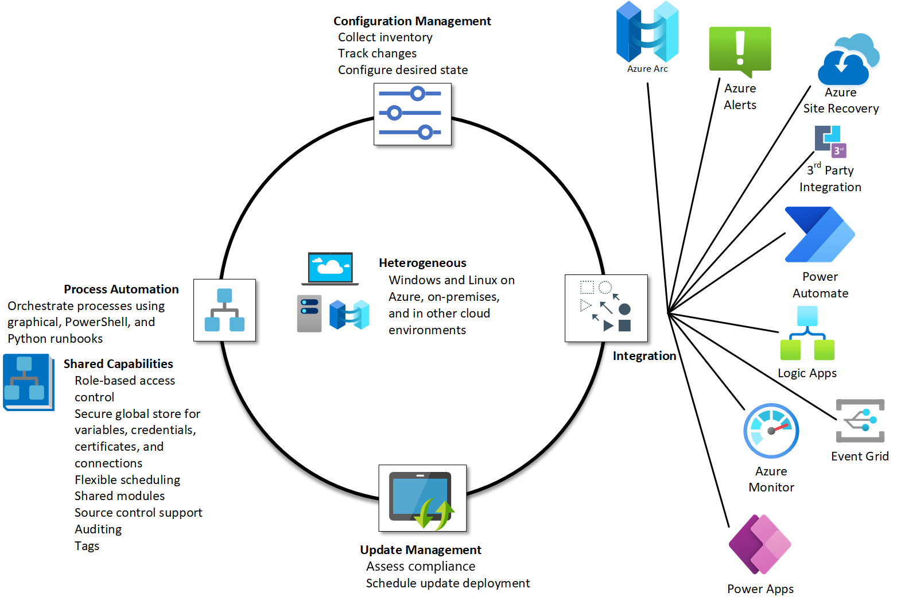
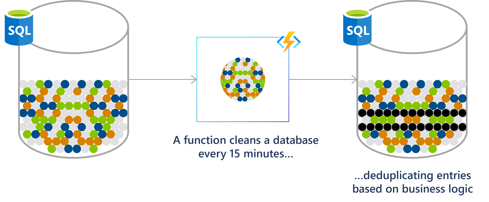
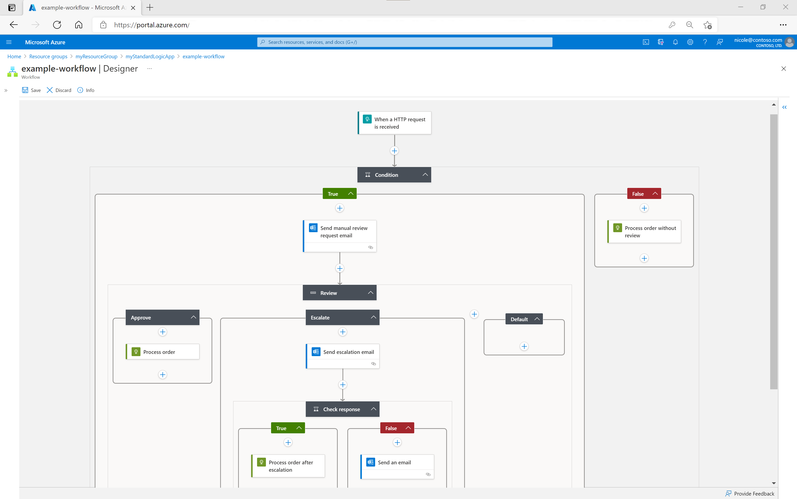

The ability to schedule and automate tasks in a cloud environment is a potent asset for system administrators and cloud cost optimization. For instance, the automated initiation of Azure VMs at the commencement of the workday, followed by their graceful termination at day's end<sup>[1]</sup>, or the dynamic scaling-up of database servers at the start of each month, aligning with the demand for comprehensive report processing, and then scaling-down post-report execution, can significantly save your monthly cloud bill.

Within the Azure ecosystem, there exist several services designed to facilitate task scheduling and automation. In this blog post, we will explore these services and analyze their strengths and weaknesses so you can decide which service makes sense for your use cases.

```bs-alert info

[1] Schedule-based [auto-shutdown virtual machines](https://azure.microsoft.com/blog/announcing-auto-shutdown-for-vms-using-azure-resource-manager/) is now a feature of Azure VMs. However, Azure does not yet offer an "auto-start" feature as the time of this post's publication.
```

Popular Azure services that support task scheduling and automation include:

- [Azure Automation](#azure-automation)
- [Azure Functions](#azure-functions)
- [Azure Logic Apps](#azure-logic-apps)

## Azure Automation

> [Azure Automation](https://learn.microsoft.com/azure/automation/) delivers a cloud-based automation, operating system updates, and configuration service that supports consistent management across your Azure and non-Azure environments. It includes process automation, configuration management, update management, shared capabilities, and heterogeneous features.
> <br/>
> \- https://learn.microsoft.com/en-us/azure/automation/overview

||
|:--:|
|_Image from https://learn.microsoft.com/azure/automation/overview_|

Azure Automation allows you to execute tasks based on predefined schedules. You can [schedule tasks](https://learn.microsoft.com/azure/automation/shared-resources/schedules#create-a-schedule) either through a command-line or through a graphical interface.

**Pros:**

- Supports task creation through code or a graphical interface.
- Offers a rich set of task templates tailored for diverse use cases.
- Permits associating a single task with multiple schedules, streamlining task organization and reusability.

**Cons:**

- Currently, Azure Automation only supports PowerShell and Python as the scripting languages for task creation.
- Proficiency in programming is required for the creation and customization of complex tasks.
- Managing packages/modules for the PowerShell/Python runtime is still manual and cumbersome.

## Azure Functions

> [Azure Functions](https://learn.microsoft.com/azure/azure-functions/) is a serverless solution that allows you to write less code, maintain less infrastructure, and save on costs. Instead of worrying about deploying and maintaining servers, the cloud infrastructure provides all the up-to-date resources needed to keep your applications running.
> <br/>
> \- https://learn.microsoft.com/en-us/azure/azure-functions/functions-overview

||
|:--:|
|_Image from https://learn.microsoft.com/azure/azure-functions/functions-scenarios#run-scheduled-tasks_|

Azure Functions support CRON syntax for [task scheduling](https://learn.microsoft.com/azure/azure-functions/functions-bindings-timer).

**Pros:**

- Scalable & Lightweight: Azure Functions are designed to be scalable and flexible. You only need to focus on writing the core logic of the task (function). Azure Functions automatically handle the bootstrapping and binding code.
- Local Development and Debugging: You can perform local development and debugging of your function before deploying them to the cloud environment.

**Cons:**

- Currently, the runtime environment only supports C#, Java, JavaScript, PowerShell, and Python <sup>[2]</sup>.
- Programming proficiency is required, making it less accessible for non-technical users.

```bs-alert info

[2] Theoretically, Azure Functions offer the capability to deploy functions written in any programming language by leveraging [containers](https://learn.microsoft.com/azure/azure-functions/functions-how-to-custom-container). However, Azure Functions does not yet support task scheduling for containerized functions.
```

## Azure Logic Apps

> [Azure Logic Apps](https://learn.microsoft.com/azure/logic-apps/) is a cloud platform where you can create and run automated workflows with little to no code. By using the visual designer and selecting from prebuilt operations, you can quickly build a workflow that integrates and manages your apps, data, services, and systems.
> <br/>
> \- https://learn.microsoft.com/en-us/azure/logic-apps/logic-apps-overview

||
|:--:|
|_Image from https://learn.microsoft.com/azure/logic-apps/logic-apps-overview_|

Azure Logic Apps allow you to [schedule and automate workflows](https://learn.microsoft.com/azure/logic-apps/concepts-schedule-automated-recurring-tasks-workflows#schedule-triggers).

**Pros:**

- Azure Logic Apps provide a user-friendly graphical interface for designing workflows, making it accessible for non-technical users.
- They boast an extensive collection of connectors to integrate with diverse cloud services.

**Cons:**

- Task effectiveness relies heavily on the availability of compatible connectors.
- Not the best choice for handling complex tasks.

## Alternative choices

In addition to the three services above, you have the option to employ the following services or approaches for scheduling and automating tasks:

**[WebJobs in Azure App Service](https://learn.microsoft.com/azure/app-service/webjobs-create)**: a feature of [Azure App Service](https://learn.microsoft.com/azure/app-service/) that enables you to run a program or script in the same instance as a web app, API app, or mobile app. WebJobs support a wide range of programming languages, including PowerShell, Bash, PHP, NodeJS, Python, Java, etc. It's important to note, however, that WebJobs must be used in conjunction with Azure App Service, and at present, they are exclusively supported on the Windows App Service platform.

**A CI/CD pipeline system such as [Azure Pipelines](https://learn.microsoft.com/azure/devops/pipelines/get-started/what-is-azure-pipelines) or [GitHub Actions](https://docs.github.com/actions).**

In contrast to Azure Automation, Functions, and Logic Apps, which have limitations in terms of supported programming languages and scripts, CI/CD pipeline systems like Azure Pipelines and GitHub Actions offer compatibility with virtually all available programming languages and scripts. The best part is that you can use Azure Pipelines and GitHub Actions for free <sup>[3][4]</sup>.

The primary drawback of Azure Pipelines and GitHub Actions currently is that pipeline schedules are configured with the default timezone, which is UTC. The cloud-based versions of Azure Pipelines and GitHub Actions do not offer the option to schedule pipelines with custom timezones. In many scenarios, this limitation is not a significant issue and can be mitigated with simple adjustments. For instance, to schedule a pipeline to execute at 8 AM in the Singapore timezone (GMT+8), you would schedule it to run at 1 AM in UTC. Nevertheless, there are at least two situations where the absence of custom timezone support can be particularly problematic:

- Daylight Saving Time (DST): in regions observing DST, you might have to adjust your pipeline execution schedule when DST begins or ends.
- Scheduling a task for a specific time, for instance _1 AM in the Singapore timezone (GMT+8) on the 1st day of every month_, can be challenging. You might be tempted to schedule it for 5 PM on the "last day of the previous month" in UTC. However, this approach poses problems because determining the exact "last day of the month" is ambiguous. Is it the 28th, 30th, 31st, or 29th? Headache, right?

```bs-alert info

[3][4] See more in details at https://azure.microsoft.com/en-us/pricing/details/devops/azure-devops-services/ and https://github.com/pricing
```

## Summary

We have explored three Azure services that you can use to schedule and automate tasks in a cloud environment: Azure Automation, Azure Functions, and Azure Logic Apps.  Each of these services brings its unique strengths and limitations, catering to diverse use cases. Here's a quick recap of the three services:

- **Azure Automation**: ideal for orchestrating and automating large-scale tasks. However, it currently supports only PowerShell and Python as scripting languages.
- **Azure Functions**: suited for on-demand task execution, such as event processing. Using Azure Functions necessitates programming expertise, and it currently offers task scheduling for functions written in C#, Java, JavaScript, PowerShell, and Python.
- **Azure Logic Apps**: enables task design via a graphical interface, eliminating the need for programming skills. However, it may not be the most effective choice for complex tasks, as its effectiveness heavily relies on the availability of compatible connectors.

If these three services don't entirely align with your requirements, you can explore alternative approaches like Azure Pipelines or GitHub Actions for task scheduling and automation.

<hr/>

```bs-alert warning

Disclaimer: I utilized ChatGPT to proofread and rephrase certain sections of this post.
```

_[[do-tag ghissue_comment.en]]_
