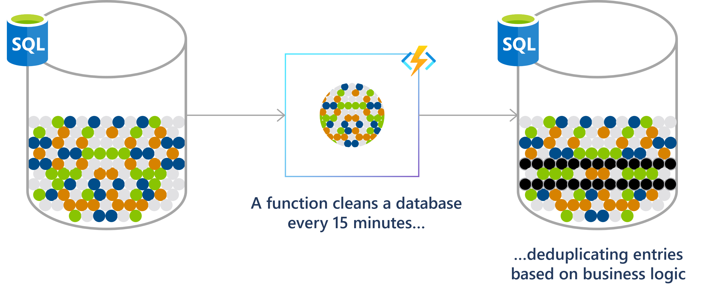

Khả năng lập lịch trình chạy tự động các tác vụ trên môi trường đám mây là công cụ đắc lực trong việc vận hành cũng như quản lý chi phí của hệ thống. Ví dụ như tự động bật các máy ảo trên Azure khi bắt đầu giờ làm việc và tắt các máy ảo vào cuối ngày<sup>[1]</sup>, hoặc scale up máy chủ CSDL vào đầu tháng khi cần chạy báo cáo tổng hợp và scale down khi các báo cáo đã chạy xong có thể tiết kiệm một khoản chi phí đáng kể vào cuối tháng.

Azure cung cấp không ít dịch vụ cho phép lập lịch trình chạy tự động các tác vụ trên môi trường đám mây. Trong bài viết này, chúng ta sẽ tìm hiểu qua các dịch vụ đó và phân tích một điểm mạnh cũng như điểm yếu của chúng.

```bs-alert info

[1] Azure cho phép bạn [đặt lịch tắt máy ảo](https://azure.microsoft.com/blog/announcing-auto-shutdown-for-vms-using-azure-resource-manager/), nhưng hiện chưa có sẵn tính năng đặt lịch bật máy ảo đang tắt.
```

Một số dịch vụ trên Azure hỗ trợ việc lập lịch trình chạy tự động tác vụ:

- [Azure Automation](#azure-automation)
- [Azure Functions](#azure-functions)
- [Azure Logic Apps](#azure-logic-apps)

## Azure Automation

[Azure Automation](https://learn.microsoft.com/azure/automation/) cung cấp dịch vụ tự động hóa dựa trên đám mây, bao gồm tự động hóa quy trình, quản lý cấu hình, quản lý cập nhật, khả năng chia sẻ và các tính năng đa dạng.

||
|:--:|
|_Ảnh từ nguồn https://learn.microsoft.com/azure/automation/overview_|

Azure Automation cho phép bạn [lập lịch trình](https://learn.microsoft.com/azure/automation/shared-resources/schedules#create-a-schedule), theo cú pháp CRON, chạy tự động tác vụ thông qua câu lệnh hoặc thao tác trên giao diện đồ hoạ.

**Điểm mạnh:**

- Hỗ trợ tạo tác vụ từ code hoặc flow trực quan thông qua giao diện đồ hoạ.
- Tác vụ mẫu đa dạng và phong phú cho nhiều tình huống sử dụng khác nhau.
- Một tác vụ có thể gắn vào nhiều lịch chạy, giúp tổ chức và tái sử dụng tác vụ dễ dàng hơn.

**Điểm yếu:**

- Hiện tại Azure Automation chỉ hỗ trợ viết mã nguồn tác vụ bằng PowerShell hoặc Python.
- Bạn cần trang bị kỹ năng lập trình với PowerShell/Python để viết hoặc chỉnh sửa/tuỳ biến các tác vụ phức tạp.
- Việc quản lý package/module cho môi trường chạy PowerShell/Python còn thủ công và phức tạp.

## Azure Functions

[Azure Functions](https://learn.microsoft.com/azure/azure-functions/) là một giải pháp phi máy chủ cho phép bạn tập trung vào việc viết mã nguồn cho các tác vụ cụ thể mà không cần quan tâm đến việc triển khai và duy trì cơ sở hạ tầng máy chủ.

||
|:--:|
|_Ảnh từ nguồn https://learn.microsoft.com/azure/azure-functions/functions-scenarios#run-scheduled-tasks_|

Azure Functions hỗ trợ cú pháp CRON [lập lịch trình](https://learn.microsoft.com/azure/azure-functions/functions-bindings-timer) chạy tự động tác vụ.

**Điểm mạnh:**

- Scalable & Lightweight: Azure Functions được thiết kế với tính mở rộng và linh hoạt cao. Bạn chỉ cần tập trung viết code xử lý logic chính của tác vụ. Các phần code phụ trợ như bootstrapping hay binding sẽ được Azure Functions tự động xử lý.
- Hỗ trợ viết code, test và debug ở local trước khi triển khai tác vụ lên môi trường đám mây.

**Điểm yếu:**

- Hiện tại môi trường chạy chỉ hỗ trợ các ngôn ngữ lập trình C#, Java, JavaScript, PowerShell và Python <sup>[2]</sup>.
- Đòi hỏi kỹ năng lập trình, không thích hợp cho đối tượng người dùng non-technical.

```bs-alert info

[2] Azure Functions trên nguyên tắc hỗ trợ triển khai tác vụ được viết ở ngôn ngữ lập trình bất kỳ thông qua [container](https://learn.microsoft.com/azure/azure-functions/functions-how-to-custom-container). Tuy nhiên, Azure Functions chưa hỗ trợ đặt lịch chạy theo thời gian cho các tác vụ đóng gói dạng container.
```

## Azure Logic Apps

[Azure Logic Apps](https://learn.microsoft.com/azure/logic-apps/) là một nền tảng đám mây giúp bạn tạo và chạy các luồng công việc tự động với ít hoặc không cần mã code. Bằng cách sử dụng giao diện thiết kế hình ảnh và lựa chọn từ các hoạt động đã được xây dựng sẵn, bạn có thể nhanh chóng xây dựng một luồng công việc (workflow) tích hợp và quản lý ứng dụng, dữ liệu, dịch vụ và hệ thống của bạn.

||
|:--:|
|_Ảnh từ nguồn https://learn.microsoft.com/azure/logic-apps/logic-apps-overview_|

Azure Logic Apps cho phép bạn [lập trình trình](https://learn.microsoft.com/azure/logic-apps/concepts-schedule-automated-recurring-tasks-workflows#schedule-triggers) tự động chạy các luồng công việc.

**Điểm mạnh:**

- Thiết kế tác vụ trực quan qua giao diện đồ hoạ, không đòi hỏi người dùng phải có kỹ năng viết code.
- Hỗ trợ sẵn nhiều kết nối tới các dịch vụ cloud khác nhau.

**Điểm yếu:**

- Tính năng của tác vụ hoàn toàn phụ thuộc vào việc 1 kết nối đến dịch vụ nào đó có sẵn hay không.
- Hiệu quả kém khi xây dựng các tác vụ phức tạp.

## Một số dịch vụ khác

Ngoài 3 dịch vụ trên Azure mà chúng ta vừa tìm hiểu, bạn cũng có thể sử dụng một số dịch vụ hoặc phương cách sau để lập lịch trình chạy tự động các tác vụ:

**[WebJobs trong Azure App Service](https://learn.microsoft.com/azure/app-service/webjobs-create)**: là một tính năng đi kèm trong dịch vụ [Azure App Service](https://learn.microsoft.com/azure/app-service/), cho phép bạn [lập lịch trình theo cú pháp CRON](https://learn.microsoft.com/azure/app-service/webjobs-create#CreateScheduledCRON) để chạy tự động các tác vụ. WebJobs hỗ trợ chạy tác vụ viết bằng nhiều ngôn ngữ khác nhau như PowerShell, Bash, PHP, NodeJS, Python, Java...Tuy nhiên, bạn cần sử dụng WebJobs kèm với dịch vụ Azure App Service; và hiện tại WebJobs chỉ được hỗ trợ trên môi trường Windows App Service.

**Các hệ thống CI/CD pipeline như [Azure Pipelines](https://learn.microsoft.com/azure/devops/pipelines/get-started/what-is-azure-pipelines) hay [GitHub Actions](https://docs.github.com/actions).**

Trong khi các tác vụ trong Azure Automation, Functions hay Logic Apps chỉ hỗ trợ một số ngôn ngữ lập trình và script nhất định, các hệ thống CI/CD pipeline như Azure Pipelines hay GitHub Actions hỗ trợ gần như tất cả các ngôn ngữ lập trình và script hiện có. Và điều hay ho nhất là bạn có thể sử dụng Azure Pinelines và GitHub Actions miễn phí <sup>[3][4]</sup>.

Phiền toái lớn nhất của Azure Pipelines và GitHub Actions ở thời điểm hiện tại là các pipeline sẽ chạy ở múi giờ mặc định UTC. Hiện phiên bản đám mây của Azure Pipelines và GitHub Actions chưa cho phép đặt lịch trình chạy theo thời gian ở múi giờ tuỳ biến. Trong đa số trường hợp đây không phải là vấn đề lớn không thể giải quyết, mà ngược lại cách giải quyết khá đơn giản: ví dụ để đặt lịch chạy một pipeline vào 8g sáng theo giờ VN (múi giờ GMT+8), bạn có thể đặt lịch chạy vào lúc 1g sáng ở múi giờ UTC. Tuy nhiên, sẽ có ít nhất 2 tình huống mà việc chưa hỗ trợ đặt lịch theo múi giờ tuỳ biến thực sự đem lại phiền toái:

- Daylight Saving Time (DST): ở các quốc gia hoặc lãnh thổ áp dụng DST, bạn có thể phải đặt lại lịch chạy của pipeline vào mỗi thời điểm DST bắt đầu hoặc kết thúc.
- Bạn cần chạy tác vụ vào lúc, chẳng hạn như _1g sáng Việt Nam (múi giờ GMT+7) vào ngày đầu tiên mỗi tháng (ngày 1 mỗi tháng)_. Theo lô-gic thông thường, ta sẽ đặt lịch chạy vào lúc 18g tối _ngày hôm trước_, tức là _ngày cuối cùng của tháng_, ở múi giờ UTC. Lúc này rắc rối xảy ra: "ngày cuối cùng của tháng" là ngày nào đây? 28, 30, 31 hay 29? Đấy, phiền thoái chưa?

```bs-alert info

[3][4] Xem chi tiết tại https://azure.microsoft.com/en-us/pricing/details/devops/azure-devops-services/ và https://github.com/pricing
```

## Tổng kết

Chúng ta đã tìm hiểu qua 3 dịch vụ trên Azure bạn có thể sử dụng để lập lịch trình chạy tự động các tác vụ trên môi trường đám mây: Azure Automation, Azure Functions và Azure Logic Apps. Mỗi dịch vụ có những điểm mạnh và điểm yếu riêng, phù hợp với các tình huống sử dụng khác nhau. Tóm tắt nhanh về 3 dịch vụ này:

- **Azure Automation**: thích hợp lên lịch trình chạy tự động các tác vụ lớn. Tuy nhiên, hiện tại chỉ hỗ trợ 2 viết mã lệnh tác vụ với PowerShell và Python.
- **Azure Functions**: thích hợp chạy các tác vụ cần xử lý nhanh, tức thời (ví dụ như xử lý các sự kiện). Azure Functions đòi hỏi kỹ năng lập trình để viết code tác vụ. Hiện Azure Functions chỉ hỗ trợ đặt lịch trình chạy tự động các tác vụ viết bằng C#, Java, JavaScript, PowerShell và Python.
- **Azure Logic Apps**: thiết kế tác vụ trực quan thông qua giao diện đồ hoạ, không đòi hỏi người dùng phải có kỹ năng viết code. Tuy nhiên, Azure Logic Apps thể hiện hiệu quả khá kém khi cần xây dựng các tác vụ phức tạp; tính năng của tác vụ hoàn toàn phụ thuộc vào việc các connector tương ứng có sẵn hay không.

Nếu 3 dịch vụ trên chưa hoàn toàn đáp ứng được nhu cầu, bạn có thể thử một số hướng tiếp cận khác ví dụ như Azure Pipelines hay GitHub Actions để lập lịch trình chạy tự động các tác vụ.

<hr >

_[[do-tag ghissue_comment.vi]]_
