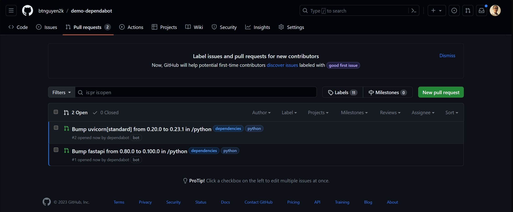

During the development lifecycle of a software product, it is crucial to regularly update third-party libraries to maintain the product's stability, performance, and security. However, as the number of third-party libraries (both direct and indirect dependencies) grows, keeping track of and updating their versions can become an extremely time-consuming and laborious task. For technical audiences, you can gain a firsthand understanding of this challenge by attempting to analyze the libraries and their versions within a NodeJS project, hint: the `package-lock.json` file 😏

Thankfully, GitHub's Dependabot offers automated tracking and updating of new versions for third-party libraries across a wide range of popular programming languages and frameworks. This blog post introduces a step-by-step guide to configuring Dependabot for automatic updates of the latest versions of third-party libraries in your project.

```bs-alert info

Dependabot version updates are free to use for all repositories on GitHub.com.
```

## Setup Dependabot

To begin, your project's source code must be hosted on [GitHub](https://github.com). To enable tracking and updating of new versions for third-party libraries, you'll need to create a `dependabot.yaml` (or .yml) file and place it in the `.github` directory of your project's repository. The content of the `dependabot.yaml` file has the following structure:

```yaml
version: 2

updates:
  - package-ecosystem: ""
    directory: "/"
    schedule:
      interval: "weekly"
```

The `dependabot.yaml` file must include the following two mandatory fields:

- `version`: The value must be 2, as per the current Dependabot specification.
- `updates`: This field is an array, where each element represents a configuration for each type of package ecosystem used in the project. The `package-ecosystem` field specifies the package ecosystem being employed. Some commonly supported package ecosystems by Dependabot include:
  - `github-actions`: GitHub Actions
  - `gomod`: Go modules
  - `npm`: JavaScript/npm/pnpm/yarn
  - `pip`: Python/pip/pipenv/poetry/pip-compile
  - `maven`: Java/Maven
  - `gradle`: Java/Gradle
  - `cargo`: Rust/cargo
  - `nuget`: .NET/nuget

```bs-alert info

Refer to the full list of package ecosystems supported by Dependabot [here](https://docs.github.com/en/code-security/dependabot/dependabot-version-updates/configuration-options-for-the-dependabot.yml-file#package-ecosystem).
```

## Examples

**GitHub Actions**: Dependabot supports updating new versions for GitHub Actions used in GitHub Actions workflows. For instance, the following configuration snippet updates the new versions for GitHub Actions on a weekly basis, every Monday.

```yaml
updates:
  - package-ecosystem: "github-actions"
    directory: "/"
    schedule:
      interval: "weekly"
      day: "monday"
```

**npm**: update new versions for npm packages on a daily schedule. Limit updates to the `lodash` package and packages with names starting with `react`. Specifically, restrict updates for the `lodash` package to the development dependency group only.

```yaml
updates:
  - package-ecosystem: "npm"
    directory: "/"
    schedule:
      interval: "daily"
    allow:
      # allow updates for package Lodash
      - dependency-name: "lodash"
        dependency-type: "development"
      # allow update for packages with names starting with "reac"
      - dependency-name: "react*"
```

```bs-alert info

Refer to Dependabot documentation on the `allow` syntax [here](https://docs.github.com/en/code-security/dependabot/dependabot-version-updates/configuration-options-for-the-dependabot.yml-file#allow).
```

**pip**: update new versions for Python packages on a weekly basis every Saturday at 3:30 AM Tokyo time. The updates will only include new minor and patch versions while avoiding major version updates.

```yaml
updates:
  - package-ecosystem: "pip"
    directory: "/"
    schedule:
      interval: "weekly"
      day: "saturday"
      time: "03:30"
      timezone: "Asia/Tokyo"
    ignore:
      # ignore major version updates
      - dependency-name: "*"
        update-types: ["version-update:semver-major"]
```

```bs-alert info

Refer to Dependabot documentation on the `ignore` syntax [here](https://docs.github.com/en/code-security/dependabot/dependabot-version-updates/configuration-options-for-the-dependabot.yml-file#ignore).
```

## How Dependabot works

Once setup correctly, GitHub will automatically trigger Dependabot based on the schedule defined in the `schedule` section. When new versions match the conditions specified in `allow` and `ignore` sections, Dependabot will create pull requests to apply the updates to the project. Below is an example of pull requests created by Dependabot::

<a href="./dependabot-pr.jpg" target="_blank"></a>

Once you receive the pull requests, you have the option to review the changes and merge them into the project's default branch.

## Automate merging pull requests created by Dependabot

While Dependabot can handle automatic updates of third-party library versions, it requires your manual review and merging of the pull requests it creates. To take it a step further, you have the option to setup a GitHub action that automates the merging process for these pull requests.

```bs-alert warning flex
<i class="fas fa-triangle-exclamation fa-xl me-2"></i>
The following code snippet showcases the automatic merge capability of pull requests created by Dependabot. In practice, you should exercise caution when enabling this functionality. Merging pull requests without going through testing or review steps may introduce potential risks to the project.
```

Create a file named `automerge.yaml` and place it in the directory `.github/workflows` of the project's repository, with the following content:

```yaml
# Automatically merge PR from dependabot

name: "Automerge"
on:
  pull_request:
    branches: [ 'main' ]

permissions:
  contents: write
  pull-requests: write

jobs:
  Test:
    # it's a good practice to run tests before merging
    runs-on: ubuntu-latest
    steps:
      - name: 'Checkout'
        uses: actions/checkout@v2
      - name: 'Install Dependencies'
        run: |
          echo "command to prepare env and pull dependencies"
      - name: Run tests
        run: |
          echo "command to run tests"

  Automerge:
    runs-on: ubuntu-latest
    needs: [ Test ] # only merge if tests pass
    steps:
      - name: 'Merge PR'
        uses: actions/github-script@v6
        with:
          github-token: ${{ secrets.GITHUB_TOKEN }}
          script: |
            if (!context.payload.pull_request) {
              console.log('Not Merged 🚫');
              console.log('No pull_request found in payload.');
              return;
            }
            console.log(`Merging PR <${context.payload.pull_request.number}>... 🕜`);
            const pr = await github.rest.pulls.get({
              owner: context.repo.owner,
              repo: context.repo.repo,
              pull_number: context.payload.pull_request.number,
            });
            if (pr.data.user.login !== 'dependabot[bot]') {
              // only merge PR created by Dependabot
              console.log('Not Merged 🚫');
              console.log(`User <${pr.data.user.login}> does not equal <dependabot[bot]>`);
            } else {
              await github.rest.pulls.merge({
                owner: context.repo.owner,
                repo: context.repo.repo,
                pull_number: context.payload.pull_request.number,
              });
              console.log('Merged 🎉');
            }
```

Commit and push the file to the `main` branch. Going forward, whenever Dependabot creates a new pull request to update a third-party library's version, the GitHub action will automatically merge the pull request into the `main` branch of the project.

## Before we wrap up

We have learned how to set up Dependabot for automated updates of new versions of third-party libraries used in the project. For detailed information, you can consult the official Dependabot documentation at https://docs.github.com/en/code-security/dependabot/dependabot-version-updates/about-dependabot-version-updates.about-dependabot-version-updates.

Dependabot is a free yet powerful tool to manage dependencies for software projects. However, Nonetheless, it is imperative to note that Dependabot does not natively support repositories outside the GitHub ecosystem. In such scenarios, you can leverage alternative Dependabot-derived tools, such as

- [dependabot-gitlab](https://gitlab.com/dependabot-gitlab/dependabot): an application powered by [dependabot-core](https://github.com/dependabot/dependabot-core) that provides automated dependency update management for GitLab platform.
- [dependabot-azure-devops](https://github.com/tinglesoftware/dependabot-azure-devops): tools for updating dependencies in Azure DevOps repositories using Dependabot.

Or third-party solutions:

- [Renovate](https://github.com/renovatebot/renovate): open-sourced, support multi-languages and multi-platforms (GitHub, GitLab, Bitbucket, Azure DevOps, AWS CodeCommit, ...).
- [FOSSA](https://fossa.com/): a SaaS solution. [Free tier](https://fossa.com/pricing) supports 5 projects <sup>[*]</sup>.

```bs-alert warning

[*] Please note that the information is accurate as of the time this blog post is published. Be aware that service providers retain the right to modify their offerings and policies without prior notice.
```

<hr/>

```bs-alert warning

Disclaimer: I utilized ChatGPT to proofread and rephrase certain sections of this post.
```

_[[do-tag ghissue_comment.en]]_
