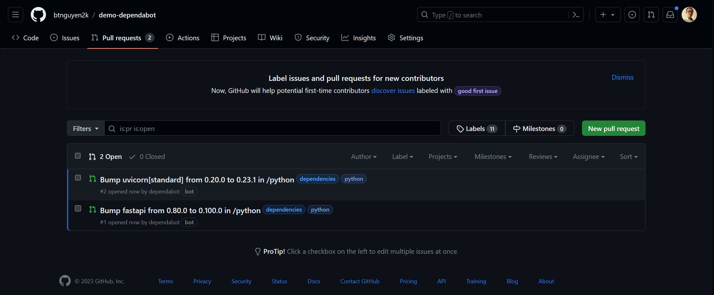

Trong suốt vòng đời phát triển của sản phẩm phần mềm, cập nhật phiên bản mới cho các thư viện của bên thứ 3 là một bước cần thiết để đảm bảo tính ổn định, hiệu năng và tính bảo mật cho sản phẩm. Tuy nhiên, khi số lượng thư viện của bên thứ 3 (trực tiếp và gián tiếp) tăng lên, việc theo dõi và cập nhật phiên bản mới cho chúng có thể trở thành 1 công việc vô cùng tốn thời gian và công sức. Bạn có thể tự trải nghiệm điều này bằng cách thử thống kê các thư viện và phiên bản của chúng trong 1 sự án NodeJS, gợi ý: tập tin `package-lock.json` 😏

Rất may mắn, Dependabot của GitHub có thể giúp chúng ta theo dõi và cập nhật phiên bản mới cho các thư viện của bên thứ 3 một cách tự động cho hầu hết các ngôn ngữ lập trình và framework phổ biến hiện nay. Bài viết này giới thiệu cách cài đặt Dependabot để tự động cập nhập các phiên bản mới nhất của các thư viện bên thứ 3 trong dự án của bạn.

```bs-alert info

Dependabot version updates miễn phí khi sử dụng với các dự án host trên GitHub.com.
```

## Cài đặt Dependabot

Đầu tiên, mã nguồn dự án của bạn cần phải host trên [GitHub](https://github.com). Bạn cài đặt tính năng theo dõi và cập nhật phiên bản mới cho thư viện bên thứ 3 bằng cách tạo 1 tập tin `dependabot.yaml` (hoặc `.yml` đều được) và đặt trong thư mục `.github` trong repository của dự án. Nội dung file `dependabot.yaml` có cấu trúc như sau:

```yaml
version: 2

updates:
  - package-ecosystem: ""
    directory: "/"
    schedule:
      interval: "weekly"
```

Tập tin `dependabot.yaml` cần có 2 trường bắt buộc sau:
- `version`: giá trị phải là 2, theo qui định hiện tại của Dependabot.
- `updates`: là một mảng, với mỗi phần tử là một bộ cấu hình cho mỗi loại hệ sinh thái package dùng trong dự án. `package-ecosystem` chỉ định hệ sinh thái package được sử dụng. Một số hệ sinh thái package thông dụng được Dependabot hỗ trợ:
  - `github-actions` GitHub Actions
  - `gomod`: Go modules
  - `npm`: JavaScript/npm/pnpm/yarn
  - `pip`: Python/pip/pipenv/poetry/pip-compile
  - `maven`: Java/Maven
  - `gradle`: Java/Gradle
  - `cargo`: Rust/cargo
  - `nuget`: .NET/nuget

```bs-alert info

Tham khảo danh sách đầy đủ các hệ sinh thái package được Dependabot hỗ trợ tại [đây](https://docs.github.com/en/code-security/dependabot/dependabot-version-updates/configuration-options-for-the-dependabot.yml-file#package-ecosystem).
```

## Ví dụ

**GitHub Actions**: Dependabot hỗ trợ cập nhật phiên bản mới cho các GitHub Actions được sử dụng trong workflow của GitHub Actions. Ví dụ đoạn cấu hình sau cập nhật phiên bản mới cho các GitHub Actions định kỳ vào thứ Hai hàng tuần.

```yaml
updates:
  - package-ecosystem: "github-actions"
    directory: "/"
    schedule:
      interval: "weekly"
      day: "monday"
```

**npm**: cập nhật phiên bản mới cho các package npm định kỳ mỗi ngày. Chỉ cập nhật package `lodash` các package có tên bắt đầu bằng `react`. Riêng với package `lodash`, chỉ cập nhật trong nhóm dependency của môi trường development.

```yaml
updates:
  - package-ecosystem: "npm"
    directory: "/"
    schedule:
      interval: "daily"
    allow:
      # cập nhật package Lodash
      - dependency-name: "lodash"
        dependency-type: "development"
      # cập nhật các package có tên bắt đầu bằng "react"
      - dependency-name: "react*"
```

```bs-alert info

Tham khảo tài liệu về cú pháp `allow` của Dependabot ở [đây](https://docs.github.com/en/code-security/dependabot/dependabot-version-updates/configuration-options-for-the-dependabot.yml-file#allow).
```

**pip**: cập nhật phiên bản mới cho các package Python định kỳ mỗi ngày tuần vào 3g30' sáng thứ Bảy, tính theo múi giờ Tokyo. Chỉ cập nhật phiên bản minor và patch mới, không cập nhật phiên bản major. 

```yaml
updates:
  - package-ecosystem: "pip"
    directory: "/"
    schedule:
      interval: "weekly"
      day: "saturday"
      time: "03:30"
      timezone: "Asia/Tokyo"
    ignore:
      # không cập nhật phiên bản major
      - dependency-name: "*"
        update-types: ["version-update:semver-major"]
```

```bs-alert info

Tham khảo tài liệu về cú pháp `ignore` của Dependabot ở [đây](https://docs.github.com/en/code-security/dependabot/dependabot-version-updates/configuration-options-for-the-dependabot.yml-file#ignore).
```

## Dependabot cập nhật phiên bản mới của các thư viện bên thứ 3 như thế nào?

Sau khi được cài đặt, GitHub sẽ tự động chạy Dependabot theo lịch được thiết lập trong phần `schedule` để theo dõi phiên bản mới của các thư viện bên thứ 3 được sử dụng trong dự án. Khi có phiên bản mới khớp với các điều kiện được thiết lập trong `allow` và `ignore`, Dependabot sẽ tạo các pull request để áp dụng các cập nhật vào trong dự án. Ví dụ như sau:

<a href="./dependabot-pr.jpg" target="_blank"></a>

Sau khi nhận được các pull request, bạn có thể xem các thay đổi được đề xuất và merge vào nhánh chính của dự án.

## Tự động merge các pull request tạo bởi Dependabot

Mặc dù Dependabot có thể tự động cập nhật phiên bản của các thư viện bên thứ 3, bạn vẫn cần phải review và merge cả pull request tạo bới Dependabot một cách thủ công. Bạn có thể tiến thêm 1 bước nữa: cài đặt 1 GitHub action tự động merge các pull request này.

```bs-alert warning flex
<i class="fas fa-triangle-exclamation fa-xl me-2"></i>
Đoạn mã tiếp sau đây nhằm mục đích trình diễn tính năng tự động merge pull request được tạo bởi Dependabot. Trong thực tế, bạn nên cân nhắc khi cài đặt tính năng này. Merge pull request không qua bước test hay review có thể sẽ gây ra một số nguy cơ tiềm ẩn cho dự án.
```

Tạo 1 file `automerge.yaml` đặt trong thư mục `.github/workflows` với nội dung như sau:

```yaml
# Tự động merge PR tạo bởi Dependabot

name: "Automerge"
on:
  pull_request:
    branches: [ 'main' ]

permissions:
  contents: write
  pull-requests: write

jobs:
  Test:
    # luôn nên chạy unit test trước khi merge
    runs-on: ubuntu-latest
    steps:
      - name: 'Checkout'
        uses: actions/checkout@v2
      - name: 'Install Dependencies'
        run: |
          echo "command to prepare env and pull dependencies"
      - name: Run tests
        run: |
          echo "command to run tests"

  Automerge:
    runs-on: ubuntu-latest
    needs: [ Test ] # chỉ thực hiện merge sau khi toàn bộ test thành công
    steps:
      - name: 'Merge PR'
        uses: actions/github-script@v6
        with:
          github-token: ${{ secrets.GITHUB_TOKEN }}
          script: |
            if (!context.payload.pull_request) {
              console.log('Not Merged 🚫');
              console.log('No pull_request found in payload.');
              return;
            }
            console.log(`Merging PR <${context.payload.pull_request.number}>... 🕜`);
            const pr = await github.rest.pulls.get({
              owner: context.repo.owner,
              repo: context.repo.repo,
              pull_number: context.payload.pull_request.number,
            });
            if (pr.data.user.login !== 'dependabot[bot]') {
              // chỉ thực hiện merge khi pull request được tạo bởi dependabot
              console.log('Not Merged 🚫');
              console.log(`User <${pr.data.user.login}> does not equal <dependabot[bot]>`);
            } else {
              await github.rest.pulls.merge({
                owner: context.repo.owner,
                repo: context.repo.repo,
                pull_number: context.payload.pull_request.number,
              });
              console.log('Merged 🎉');
            }
```

Commit và push file mới lên nhánh `main`. Từ lúc này, mỗi khi Dependabot tạo pull request để cập nhật phiên bản mới cho các thư viện bên thứ 3, GitHub action sẽ tự động merge các pull request này vào nhánh `main` của dự án.

## Trước khi kết thúc

Chúng ta đã tìm hiểu cách cài đặt Dependabot để tự động cập nhật phiên bản mới cho các thư viện bên thứ 3 được sử dụng trong dự án. Bạn có thể tham khảo tài liệu chính thức của Dependabot tại https://docs.github.com/en/code-security/dependabot/dependabot-version-updates/about-dependabot-version-updates.

Dependabot là một công cụ miễn phí và mạnh mẽ để theo dõi và cập nhật phiên bản mới cho các thư viện bên thứ 3. Tuy nhiên, Dependabot chỉ hoạt động với các dự án host trên GitHub. Nếu dự án của bạn không host trên GitHub, bạn có thể sử dụng một số công cụ xây dựng dựa trên Dependabot như:

- [dependabot-gitlab](https://gitlab.com/dependabot-gitlab/dependabot): là một ứng dụng xây dựng trên thư viện [dependabot-core](https://github.com/dependabot/dependabot-core), cung cấp tính năng tương tự như Dependabot cho các dự án host trên GitLab.
- [dependabot-azure-devops](https://github.com/tinglesoftware/dependabot-azure-devops): là một công cụ sử dụng Dependabot để theo dõi và cập nhật thư viện bên thứ 3 cho các dự án host trên Azure DevOps.

Hoặc một số giải pháp của bên thứ 3 như:

- [Renovate](https://github.com/renovatebot/renovate): mã nguồn mở, hỗ trợ đa ngôn ngữ và đa nền tảng (GitHub, GitLab, Bitbucket, Azure DevOps, AWS CodeCommit, ...).
- [FOSSA](https://fossa.com/): là một giải pháp dạng SaaS. [Gói miễn phí](https://fossa.com/pricing) hỗ trợ 5 dự án <sup>[*]</sup>.

```bs-alert warning

[*] Thông tin ở thời điểm bài viết được đăng tải. Bên cung cấp dịch vụ có thể thay đổi chính sách bất cứ lúc nào.
```

<hr >

_[[do-tag ghissue_comment.vi]]_
